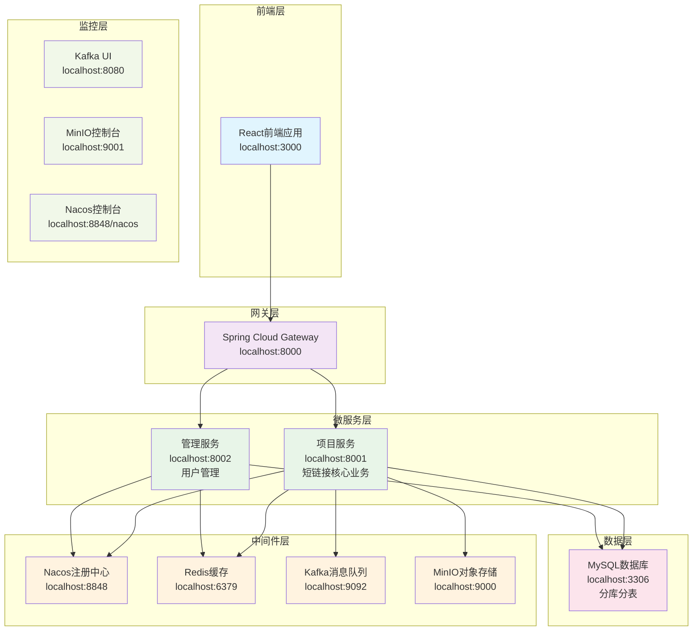
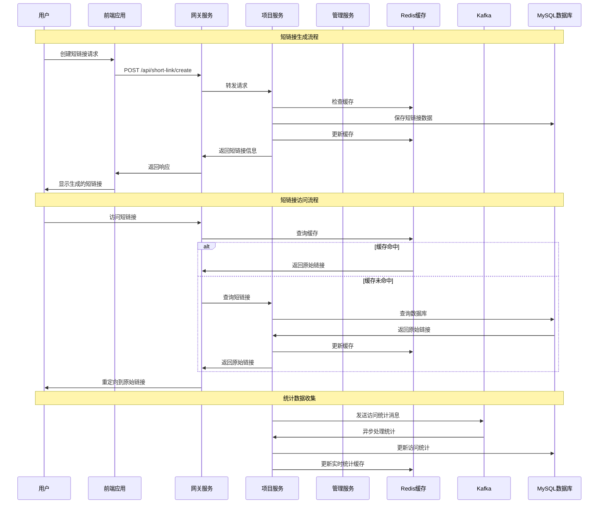

# 短链接系统 (Short Link System)

一个基于 Spring Cloud 微服务架构的短链接管理系统，支持短链接生成、管理、统计和回收站功能。

## 📋 项目简介

短链接系统是一个完整的短链接管理平台，提供以下核心功能：

- 🔗 **短链接生成**: 支持随机生成短链接
- 📊 **数据统计**: 实时访问统计、地域分析、设备分析
- 🗂️ **分组管理**: 支持短链接分组管理
- 🗑️ **回收站**: 删除的短链接可恢复
- 👤 **用户管理**: 用户注册、登录、权限管理
- 📈 **监控面板**: 可视化数据展示

## 🏗️ 技术架构

### 系统架构图



### 数据流架构图



### 后端技术栈
- **框架**: Spring Boot 3.0.7 + Spring Cloud 2022.0.3
- **微服务**: Spring Cloud Alibaba 2022.0.0.0-RC2
- **注册中心**: Nacos 2.4.2
- **网关**: Spring Cloud Gateway
- **数据库**: MySQL 8.0 + ShardingSphere 5.3.2 (分库分表)
- **缓存**: Redis 7 + Redisson 3.21.3
- **消息队列**: Kafka 7.4.0
- **对象存储**: MinIO
- **ORM**: MyBatis Plus 3.5.3.1
- **安全**: JWT

### 前端技术栈
- **框架**: React 18.2.0 + TypeScript
- **UI组件**: Ant Design 5.12.8
- **状态管理**: Redux Toolkit 2.0.1
- **路由**: React Router DOM 6.20.1
- **图表**: Recharts 2.8.0
- **构建工具**: CRACO 7.1.0

### 中间件服务
- **MySQL**: 数据库服务
- **Redis**: 缓存服务
- **Kafka**: 消息队列
- **Zookeeper**: Kafka依赖
- **MinIO**: 对象存储
- **Nacos**: 服务注册与配置中心

## 🚀 快速开始

### 环境要求

- **Java**: 17+
- **Node.js**: 16+
- **Docker**: 20.10+
- **Docker Compose**: 2.0+
- **Maven**: 3.6+

### 1. 克隆项目

```bash
git clone <repository-url>
cd short-link
```

### 2. 环境检查

```bash
cd deployment
./check-environment.sh
```

### 3. 启动中间件服务

```bash
# 一键启动所有中间件服务
./middleware-start.sh
```

该脚本会自动启动以下服务：
- MySQL (端口: 3306)
- Redis (端口: 6379)
- Kafka (端口: 9092)
- Zookeeper (端口: 2181)
- MinIO (端口: 9000/9001)
- Nacos (端口: 8848)

### 4. 验证中间件服务

```bash
# 测试所有中间件服务连接
./test-services.sh
```

### 5. 启动后端服务

```bash
# 启动网关服务 (端口: 8000)
cd gateway
mvn spring-boot:run

# 启动项目服务 (端口: 8001)
cd project
mvn spring-boot:run

# 启动管理服务 (端口: 8002)
cd admin
mvn spring-boot:run
```

### 6. 启动前端服务

```bash
cd frontend
./start.sh
# 或者
npm start
```

前端服务将在 http://localhost:3000 启动

## 🌐 服务访问地址

| 服务 | 地址 | 说明 |
|------|------|------|
| 前端应用 | http://localhost:3000 | React前端界面 |
| 网关服务 | http://localhost:8000 | API网关 |
| 项目服务 | http://localhost:8001 | 短链接核心服务 |
| 管理服务 | http://localhost:8002 | 用户管理服务 |
| Nacos控制台 | http://localhost:8848/nacos | 服务注册中心 |
| MinIO控制台 | http://localhost:9001 | 对象存储管理 |
| Kafka UI | http://localhost:8080 | Kafka管理界面 |

## 🔧 配置说明

### 环境变量配置

在 `deployment/.env` 文件中配置以下环境变量：

```bash
# 数据库配置
MYSQL_ROOT_PASSWORD=root123456
MYSQL_DATABASE=shortlink
MYSQL_USER=shortlink
MYSQL_PASSWORD=shortlink123

# Redis配置
REDIS_PASSWORD=redis123

# MinIO配置
MINIO_ROOT_USER=minioadmin
MINIO_ROOT_PASSWORD=minioadmin123

# 邮件配置
EMAIL_USERNAME=your-email@qq.com
EMAIL_PASSWORD=your-email-password

# 高德地图API Key
AMAP_KEY=your-amap-key

# 域名配置
SHORT_LINK_DOMAIN=http://localhost:8000
```

### 数据库配置

系统使用 ShardingSphere 进行分库分表，配置文件位于：
- `admin/src/main/resources/shardingsphere-config-dev.yaml`
- `project/src/main/resources/shardingsphere-config-dev.yaml`

### 前端配置

前端环境配置文件 `.env`：
```bash
REACT_APP_API_BASE_URL=http://localhost:8000
GENERATE_SOURCEMAP=false
```

## 📁 项目结构

```
short-link/
├── admin/                    # 管理服务模块
│   ├── src/main/java/       # Java源码
│   └── src/main/resources/  # 配置文件
├── project/                 # 项目服务模块
│   ├── src/main/java/       # Java源码
│   └── src/main/resources/  # 配置文件
├── gateway/                 # 网关服务模块
│   ├── src/main/java/       # Java源码
│   └── src/main/resources/  # 配置文件
├── frontend/                # 前端应用
│   ├── src/                 # React源码
│   ├── public/              # 静态资源
│   └── package.json         # 依赖配置
├── deployment/              # 部署配置
│   ├── docker-compose.yml   # Docker编排文件
│   ├── middleware-start.sh  # 中间件启动脚本
│   ├── check-environment.sh # 环境检查脚本
│   └── test-services.sh     # 服务测试脚本
├── resources/               # 资源文件
│   └── database/            # 数据库脚本
└── pom.xml                  # Maven父项目配置
```

## 🗄️ 数据库设计

系统采用分库分表设计，主要表结构：

- **t_group_0~15**: 分组表 (16个分表)
- **t_link_0~15**: 短链接表 (16个分表)
- **t_link_access_stats_0~15**: 访问统计表 (16个分表)
- **t_user**: 用户表
- **t_user_0~15**: 用户分表 (16个分表)

## 🔐 默认账号

- **Nacos控制台**: nacos / nacos
- **MinIO控制台**: minioadmin / minioadmin123
- **MySQL**: root / root123456

## 🛠️ 开发指南

### 后端开发

1. **添加新接口**:
   - 在对应的Controller中添加接口
   - 在Service层实现业务逻辑
   - 在Mapper层添加数据访问

2. **数据库操作**:
   - 使用MyBatis Plus进行数据库操作
   - 注意分表规则，确保数据正确路由

3. **缓存使用**:
   - 使用Redisson进行Redis操作
   - 合理设置缓存过期时间

### 前端开发

1. **添加新页面**:
   - 在 `src/pages/` 目录下创建页面组件
   - 在 `src/api/` 目录下添加API接口
   - 在路由配置中添加新路由

2. **状态管理**:
   - 使用Redux Toolkit进行状态管理
   - 在 `src/store/slices/` 目录下创建slice

## 🐛 常见问题

### 1. 端口占用问题

```bash
# 检查端口占用
lsof -i :3306
lsof -i :6379
lsof -i :8848

# 停止占用端口的进程
kill -9 <PID>
```

### 2. Docker服务启动失败

```bash
# 检查Docker服务状态
docker info

# 重启Docker服务
sudo systemctl restart docker
```

### 3. 数据库连接失败

```bash
# 检查MySQL容器状态
docker logs mysql

# 重启MySQL容器
docker restart mysql
```

### 4. 前端依赖安装失败

```bash
# 清除npm缓存
npm cache clean --force

# 删除node_modules重新安装
rm -rf node_modules package-lock.json
npm install
```

## 📝 开发日志

- **v1.0.0**: 初始版本，包含基础短链接功能
- 支持短链接生成、管理、统计
- 支持用户注册、登录、权限管理
- 支持分组管理和回收站功能

## 🤝 贡献指南

1. Fork 本仓库
2. 创建特性分支 (`git checkout -b feature/AmazingFeature`)
3. 提交更改 (`git commit -m 'Add some AmazingFeature'`)
4. 推送到分支 (`git push origin feature/AmazingFeature`)
5. 打开 Pull Request

## 📄 许可证

本项目采用 MIT 许可证 - 查看 [LICENSE](LICENSE) 文件了解详情

## 📞 联系方式

如有问题或建议，请通过以下方式联系：

- 项目Issues: [GitHub Issues](https://github.com/your-repo/issues)
- 邮箱: your-email@example.com

---

**注意**: 请确保在生产环境中修改默认密码和配置信息，确保系统安全。
