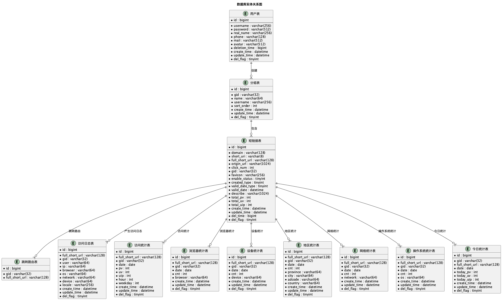

# 短链接系统数据库设计文档

## 目录

1. [数据库概述](#1-数据库概述)
2. [分库分表策略](#2-分库分表策略)
3. [核心数据表设计](#3-核心数据表设计)
4. [数据表关系图](#4-数据表关系图)
5. [索引设计](#5-索引设计)
6. [数据安全设计](#6-数据安全设计)
7. [性能优化设计](#7-性能优化设计)
8. [数据迁移策略](#8-数据迁移策略)

---

## 1. 数据库概述

### 1.1 数据库选型

**主数据库**：MySQL 8.0
- 支持高并发读写
- 完善的事务支持
- 丰富的索引类型
- 良好的分库分表支持

**缓存数据库**：Redis 7
- 高性能内存存储
- 支持多种数据结构
- 持久化支持
- 集群模式支持

### 1.2 设计原则

**1. 数据一致性**
- 使用事务保证数据一致性
- 采用分布式事务处理跨表操作
- 实现最终一致性机制

**2. 高性能**
- 分库分表支持水平扩展
- 合理的索引设计
- 读写分离架构

**3. 高可用**
- 主从复制架构
- 自动故障转移
- 数据备份和恢复

**4. 数据安全**
- 敏感数据加密存储
- 访问权限控制
- 审计日志记录

### 1.3 命名规范

**表命名规范**
- 表名使用小写字母和下划线
- 分表使用 `_数字` 后缀
- 示例：`t_user_0`, `t_link_1`

**字段命名规范**
- 字段名使用小写字母和下划线
- 主键统一使用 `id`
- 外键使用 `_id` 后缀
- 时间字段使用 `_time` 后缀

**索引命名规范**
- 主键索引：`PRIMARY`
- 唯一索引：`idx_unique_字段名`
- 普通索引：`idx_字段名`
- 复合索引：`idx_字段1_字段2`

---

## 2. 分库分表策略

### 2.1 分片策略

**分片算法**：HASH_MOD（取模算法）
- 根据分片键计算哈希值
- 对分表数量取模得到分表编号
- 保证数据分布均匀

**分片键选择**
- 用户表：`username`（用户名）
- 分组表：`username`（用户名）
- 短链接表：`gid`（分组标识）
- 跳转表：`full_short_url`（完整短链接）
- 访问日志表：`gid`（分组标识）
- 统计表：`gid`（分组标识）

### 2.2 分表配置

| 表名 | 分表数量 | 分片键 | 说明 |
|------|---------|--------|------|
| t_user | 16 | username | 用户表 |
| t_group | 16 | username | 分组表 |
| t_link | 16 | gid | 短链接表 |
| t_link_goto | 16 | full_short_url | 跳转路由表 |
| t_link_access_logs | 64 | gid | 访问日志表 |
| t_link_access_stats | 32 | gid | 访问统计表 |
| t_link_browser_stats | 16 | gid | 浏览器统计表 |
| t_link_device_stats | 16 | gid | 设备统计表 |
| t_link_locale_stats | 16 | gid | 地区统计表 |
| t_link_network_stats | 16 | gid | 网络统计表 |
| t_link_os_stats | 16 | gid | 操作系统统计表 |
| t_link_stats_today | 16 | gid | 今日统计表 |

### 2.3 分库分表配置示例

```yaml
# ShardingSphere配置示例
dataSources:
  ds0:
    driver-class-name: com.mysql.cj.jdbc.Driver
    url: jdbc:mysql://localhost:3306/shortlink_0
    username: root
    password: password
  ds1:
    driver-class-name: com.mysql.cj.jdbc.Driver
    url: jdbc:mysql://localhost:3306/shortlink_1
    username: root
    password: password

rules:
  - !SHARDING
    tables:
      t_user:
        actual-data-nodes: ds$->{0..1}.t_user_$->{0..15}
        database-strategy:
          standard:
            sharding-column: username
            sharding-algorithm-name: user_db_inline
        table-strategy:
          standard:
            sharding-column: username
            sharding-algorithm-name: user_table_inline
```

---

## 3. 核心数据表设计

### 3.1 用户表 (t_user)

#### 3.1.1 表结构

```sql
CREATE TABLE `t_user_0` (
    `id`            bigint(20) NOT NULL AUTO_INCREMENT COMMENT 'ID',
    `gid`           varchar(32)  DEFAULT NULL COMMENT '分组标识',
    `username`      varchar(256) DEFAULT NULL COMMENT '用户名',
    `password`      varchar(512) DEFAULT NULL COMMENT '密码（AES加密）',
    `real_name`     varchar(256) DEFAULT NULL COMMENT '真实姓名',
    `phone`         varchar(128) DEFAULT NULL COMMENT '手机号（AES加密）',
    `mail`          varchar(512) DEFAULT NULL COMMENT '邮箱（AES加密）',
    `avatar`        varchar(512) DEFAULT NULL COMMENT '头像URL',
    `deletion_time` bigint(20) DEFAULT NULL COMMENT '注销时间戳',
    `create_time`   datetime     DEFAULT NULL COMMENT '创建时间',
    `update_time`   datetime     DEFAULT NULL COMMENT '修改时间',
    `del_flag`      tinyint(1) DEFAULT NULL COMMENT '删除标识 0：未删除 1：已删除',
    PRIMARY KEY (`id`),
    UNIQUE KEY `idx_unique_username` (`username`) USING BTREE,
    KEY `idx_gid_del_flag` (`gid`, `del_flag`) USING BTREE
) ENGINE=InnoDB DEFAULT CHARSET=utf8mb4 COMMENT='用户表';
```

#### 3.1.2 字段说明

| 字段名 | 类型 | 长度 | 允许空 | 默认值 | 说明 |
|--------|------|------|--------|--------|------|
| id | bigint | 20 | NO | AUTO_INCREMENT | 主键ID |
| gid | varchar | 32 | YES | NULL | 分组标识 |
| username | varchar | 256 | YES | NULL | 用户名（唯一） |
| password | varchar | 512 | YES | NULL | 密码（AES加密） |
| real_name | varchar | 256 | YES | NULL | 真实姓名 |
| phone | varchar | 128 | YES | NULL | 手机号（AES加密） |
| mail | varchar | 512 | YES | NULL | 邮箱（AES加密） |
| avatar | varchar | 512 | YES | NULL | 头像URL |
| deletion_time | bigint | 20 | YES | NULL | 注销时间戳 |
| create_time | datetime | - | YES | NULL | 创建时间 |
| update_time | datetime | - | YES | NULL | 修改时间 |
| del_flag | tinyint | 1 | YES | NULL | 删除标识 |

#### 3.1.3 数据加密

- **password**：使用AES-128加密存储
- **phone**：使用AES-128加密存储
- **mail**：使用AES-128加密存储

### 3.2 分组表 (t_group)

#### 3.2.1 表结构

```sql
CREATE TABLE `t_group_0` (
    `id`          bigint(20) NOT NULL AUTO_INCREMENT COMMENT 'ID',
    `gid`         varchar(32)  DEFAULT NULL COMMENT '分组标识',
    `name`        varchar(64)  DEFAULT NULL COMMENT '分组名称',
    `username`    varchar(256) DEFAULT NULL COMMENT '创建分组用户名',
    `sort_order`  int(3) DEFAULT NULL COMMENT '分组排序',
    `create_time` datetime     DEFAULT NULL COMMENT '创建时间',
    `update_time` datetime     DEFAULT NULL COMMENT '修改时间',
    `del_flag`    tinyint(1) DEFAULT NULL COMMENT '删除标识 0：未删除 1：已删除',
    PRIMARY KEY (`id`),
    KEY `idx_username` (`username`) USING BTREE,
    KEY `idx_gid_del_flag` (`gid`, `del_flag`) USING BTREE
) ENGINE=InnoDB DEFAULT CHARSET=utf8mb4 COMMENT='分组表';
```

#### 3.2.2 字段说明

| 字段名 | 类型 | 长度 | 允许空 | 默认值 | 说明 |
|--------|------|------|--------|--------|------|
| id | bigint | 20 | NO | AUTO_INCREMENT | 主键ID |
| gid | varchar | 32 | YES | NULL | 分组标识（唯一） |
| name | varchar | 64 | YES | NULL | 分组名称 |
| username | varchar | 256 | YES | NULL | 创建分组用户名 |
| sort_order | int | 3 | YES | NULL | 分组排序 |
| create_time | datetime | - | YES | NULL | 创建时间 |
| update_time | datetime | - | YES | NULL | 修改时间 |
| del_flag | tinyint | 1 | YES | NULL | 删除标识 |

### 3.3 短链接表 (t_link)

#### 3.3.1 表结构

```sql
CREATE TABLE `t_link_0` (
    `id`              bigint(20) NOT NULL AUTO_INCREMENT COMMENT 'ID',
    `domain`          varchar(128)                                   DEFAULT NULL COMMENT '域名',
    `short_uri`       varchar(8) CHARACTER SET utf8 COLLATE utf8_bin DEFAULT NULL COMMENT '短链接',
    `full_short_url`  varchar(128)                                   DEFAULT NULL COMMENT '完整短链接',
    `origin_url`      varchar(1024)                                  DEFAULT NULL COMMENT '原始链接',
    `click_num`       int(11) DEFAULT '0' COMMENT '点击量',
    `gid`             varchar(32)                                    DEFAULT 'default' COMMENT '分组标识',
    `favicon`         varchar(256)                                   DEFAULT NULL COMMENT '网站图标',
    `enable_status`   tinyint(1) DEFAULT NULL COMMENT '启用标识 0：启用 1：未启用',
    `created_type`    tinyint(1) DEFAULT NULL COMMENT '创建类型 0：接口创建 1：控制台创建',
    `valid_date_type` tinyint(1) DEFAULT NULL COMMENT '有效期类型 0：永久有效 1：自定义',
    `valid_date`      datetime                                       DEFAULT NULL COMMENT '有效期',
    `describe`        varchar(1024)                                  DEFAULT NULL COMMENT '描述',
    `total_pv`        int(11) DEFAULT NULL COMMENT '历史PV',
    `total_uv`        int(11) DEFAULT NULL COMMENT '历史UV',
    `total_uip`       int(11) DEFAULT NULL COMMENT '历史UIP',
    `create_time`     datetime                                       DEFAULT NULL COMMENT '创建时间',
    `update_time`     datetime                                       DEFAULT NULL COMMENT '修改时间',
    `del_time`        bigint(20) DEFAULT '0' COMMENT '删除时间戳',
    `del_flag`        tinyint(1) DEFAULT NULL COMMENT '删除标识 0：未删除 1：已删除',
    PRIMARY KEY (`id`),
    UNIQUE KEY `idx_unique_full-short-url` (`full_short_url`,`del_time`) USING BTREE,
    KEY `idx_gid_status_del` (`gid`, `enable_status`, `del_flag`) USING BTREE,
    KEY `idx_gid_create_time` (`gid`, `create_time`) USING BTREE
) ENGINE=InnoDB DEFAULT CHARSET=utf8mb4 COMMENT='短链接表';
```

#### 3.3.2 字段说明

| 字段名 | 类型 | 长度 | 允许空 | 默认值 | 说明 |
|--------|------|------|--------|--------|------|
| id | bigint | 20 | NO | AUTO_INCREMENT | 主键ID |
| domain | varchar | 128 | YES | NULL | 域名 |
| short_uri | varchar | 8 | YES | NULL | 短链接后缀 |
| full_short_url | varchar | 128 | YES | NULL | 完整短链接 |
| origin_url | varchar | 1024 | YES | NULL | 原始链接 |
| click_num | int | 11 | YES | 0 | 点击量 |
| gid | varchar | 32 | YES | default | 分组标识 |
| favicon | varchar | 256 | YES | NULL | 网站图标 |
| enable_status | tinyint | 1 | YES | NULL | 启用标识 |
| created_type | tinyint | 1 | YES | NULL | 创建类型 |
| valid_date_type | tinyint | 1 | YES | NULL | 有效期类型 |
| valid_date | datetime | - | YES | NULL | 有效期 |
| describe | varchar | 1024 | YES | NULL | 描述 |
| total_pv | int | 11 | YES | NULL | 历史PV |
| total_uv | int | 11 | YES | NULL | 历史UV |
| total_uip | int | 11 | YES | NULL | 历史UIP |
| create_time | datetime | - | YES | NULL | 创建时间 |
| update_time | datetime | - | YES | NULL | 修改时间 |
| del_time | bigint | 20 | YES | 0 | 删除时间戳 |
| del_flag | tinyint | 1 | YES | NULL | 删除标识 |

### 3.4 跳转路由表 (t_link_goto)

#### 3.4.1 表结构

```sql
CREATE TABLE `t_link_goto_0` (
    `id`             bigint(20) NOT NULL AUTO_INCREMENT COMMENT 'ID',
    `gid`            varchar(32)  DEFAULT 'default' COMMENT '分组标识',
    `full_short_url` varchar(128) DEFAULT NULL COMMENT '完整短链接',
    PRIMARY KEY (`id`),
    UNIQUE KEY `idx_full_short_url` (`full_short_url`) USING BTREE
) ENGINE=InnoDB DEFAULT CHARSET=utf8mb4 COMMENT='短链接跳转路由表';
```

#### 3.4.2 设计说明

- **用途**：专门用于短链接跳转查询，优化查询性能
- **分片键**：`full_short_url`，用户访问时根据短链接直接定位到对应分表
- **索引**：`full_short_url` 唯一索引，保证查询效率

### 3.5 访问日志表 (t_link_access_logs)

#### 3.5.1 表结构

```sql
CREATE TABLE `t_link_access_logs_0` (
    `id`             bigint(20) NOT NULL AUTO_INCREMENT COMMENT 'ID',
    `full_short_url` varchar(128) DEFAULT NULL COMMENT '完整短链接',
    `gid`            varchar(32)  DEFAULT NULL COMMENT '分组标识',
    `user`           varchar(64)  DEFAULT NULL COMMENT '用户信息',
    `ip`             varchar(64)  DEFAULT NULL COMMENT 'IP',
    `browser`        varchar(64)  DEFAULT NULL COMMENT '浏览器',
    `os`             varchar(64)  DEFAULT NULL COMMENT '操作系统',
    `network`        varchar(64)  DEFAULT NULL COMMENT '访问网络',
    `device`         varchar(64)  DEFAULT NULL COMMENT '访问设备',
    `locale`         varchar(256) DEFAULT NULL COMMENT '地区',
    `create_time`    datetime     DEFAULT NULL COMMENT '创建时间',
    `update_time`    datetime     DEFAULT NULL COMMENT '修改时间',
    `del_flag`       tinyint(1) DEFAULT NULL COMMENT '删除标识 0：未删除 1：已删除',
    PRIMARY KEY (`id`),
    KEY `idx_full_short_url` (`full_short_url`) USING BTREE,
    KEY `idx_gid` (`gid`) USING BTREE,
    KEY `idx_create_time` (`create_time`) USING BTREE,
    KEY `idx_gid_create_time` (`gid`, `create_time`) USING BTREE
) ENGINE=InnoDB DEFAULT CHARSET=utf8mb4 COMMENT='访问日志表';
```

#### 3.5.2 字段说明

| 字段名 | 类型 | 长度 | 允许空 | 默认值 | 说明 |
|--------|------|------|--------|--------|------|
| id | bigint | 20 | NO | AUTO_INCREMENT | 主键ID |
| full_short_url | varchar | 128 | YES | NULL | 完整短链接 |
| gid | varchar | 32 | YES | NULL | 分组标识 |
| user | varchar | 64 | YES | NULL | 用户信息 |
| ip | varchar | 64 | YES | NULL | IP地址 |
| browser | varchar | 64 | YES | NULL | 浏览器 |
| os | varchar | 64 | YES | NULL | 操作系统 |
| network | varchar | 64 | YES | NULL | 访问网络 |
| device | varchar | 64 | YES | NULL | 访问设备 |
| locale | varchar | 256 | YES | NULL | 地区 |
| create_time | datetime | - | YES | NULL | 创建时间 |
| update_time | datetime | - | YES | NULL | 修改时间 |
| del_flag | tinyint | 1 | YES | NULL | 删除标识 |

### 3.6 访问统计表 (t_link_access_stats)

#### 3.6.1 表结构

```sql
CREATE TABLE `t_link_access_stats_0` (
    `id`             bigint(20) NOT NULL AUTO_INCREMENT COMMENT 'ID',
    `full_short_url` varchar(128) DEFAULT NULL COMMENT '完整短链接',
    `gid`            varchar(32)  DEFAULT NULL COMMENT '分组标识',
    `date`           date         DEFAULT NULL COMMENT '日期',
    `pv`             int(11) DEFAULT NULL COMMENT '访问量',
    `uv`             int(11) DEFAULT NULL COMMENT '独立访客数',
    `uip`            int(11) DEFAULT NULL COMMENT '独立IP数',
    `hour`           int(3) DEFAULT NULL COMMENT '小时',
    `weekday`        int(3) DEFAULT NULL COMMENT '星期',
    `create_time`    datetime     DEFAULT NULL COMMENT '创建时间',
    `update_time`    datetime     DEFAULT NULL COMMENT '修改时间',
    `del_flag`       tinyint(1) DEFAULT NULL COMMENT '删除标识 0：未删除 1：已删除',
    PRIMARY KEY (`id`),
    UNIQUE KEY `idx_unique_access_stats` (`gid`,`full_short_url`,`date`,`hour`),
    KEY `idx_gid_date` (`gid`, `date`) USING BTREE
) ENGINE=InnoDB DEFAULT CHARSET=utf8mb4 COMMENT='访问统计表';
```

### 3.7 其他统计表

#### 3.7.1 浏览器统计表 (t_link_browser_stats)

```sql
CREATE TABLE `t_link_browser_stats_0` (
    `id`             bigint(20) NOT NULL AUTO_INCREMENT COMMENT 'ID',
    `full_short_url` varchar(128) DEFAULT NULL COMMENT '完整短链接',
    `gid`            varchar(32)  DEFAULT NULL COMMENT '分组标识',
    `date`           date         DEFAULT NULL COMMENT '日期',
    `cnt`            int(11) DEFAULT NULL COMMENT '访问量',
    `browser`        varchar(64)  DEFAULT NULL COMMENT '浏览器',
    `create_time`    datetime     DEFAULT NULL COMMENT '创建时间',
    `update_time`    datetime     DEFAULT NULL COMMENT '修改时间',
    `del_flag`       tinyint(1) DEFAULT NULL COMMENT '删除标识 0：未删除 1：已删除',
    PRIMARY KEY (`id`),
    UNIQUE KEY `idx_unique_browser_stats` (`gid`,`full_short_url`,`date`,`browser`) USING BTREE,
    KEY `idx_gid_date` (`gid`, `date`) USING BTREE
) ENGINE=InnoDB DEFAULT CHARSET=utf8mb4 COMMENT='浏览器统计表';
```

#### 3.7.2 设备统计表 (t_link_device_stats)

```sql
CREATE TABLE `t_link_device_stats_0` (
    `id`             bigint(20) NOT NULL AUTO_INCREMENT COMMENT 'ID',
    `full_short_url` varchar(128) DEFAULT NULL COMMENT '完整短链接',
    `gid`            varchar(32)  DEFAULT NULL COMMENT '分组标识',
    `date`           date         DEFAULT NULL COMMENT '日期',
    `cnt`            int(11) DEFAULT NULL COMMENT '访问量',
    `device`         varchar(64)  DEFAULT NULL COMMENT '访问设备',
    `create_time`    datetime     DEFAULT NULL COMMENT '创建时间',
    `update_time`    datetime     DEFAULT NULL COMMENT '修改时间',
    `del_flag`       tinyint(1) DEFAULT NULL COMMENT '删除标识 0：未删除 1：已删除',
    PRIMARY KEY (`id`),
    UNIQUE KEY `idx_unique_device_stats` (`gid`,`full_short_url`,`date`,`device`) USING BTREE,
    KEY `idx_gid_date` (`gid`, `date`) USING BTREE
) ENGINE=InnoDB DEFAULT CHARSET=utf8mb4 COMMENT='设备统计表';
```

#### 3.7.3 地区统计表 (t_link_locale_stats)

```sql
CREATE TABLE `t_link_locale_stats_0` (
    `id`             bigint(20) NOT NULL AUTO_INCREMENT COMMENT 'ID',
    `full_short_url` varchar(128) DEFAULT NULL COMMENT '完整短链接',
    `gid`            varchar(32)  DEFAULT NULL COMMENT '分组标识',
    `date`           date         DEFAULT NULL COMMENT '日期',
    `cnt`            int(11) DEFAULT NULL COMMENT '访问量',
    `province`       varchar(64)  DEFAULT NULL COMMENT '省份名称',
    `city`           varchar(64)  DEFAULT NULL COMMENT '市名称',
    `adcode`         varchar(64)  DEFAULT NULL COMMENT '城市编码',
    `country`        varchar(64)  DEFAULT NULL COMMENT '国家标识',
    `create_time`    datetime     DEFAULT NULL COMMENT '创建时间',
    `update_time`    datetime     DEFAULT NULL COMMENT '修改时间',
    `del_flag`       tinyint(1) DEFAULT NULL COMMENT '删除标识 0：未删除 1：已删除',
    PRIMARY KEY (`id`),
    UNIQUE KEY `idx_unique_locale_stats` (`gid`,`full_short_url`,`date`,`adcode`,`province`) USING BTREE,
    KEY `idx_gid_date` (`gid`, `date`) USING BTREE
) ENGINE=InnoDB DEFAULT CHARSET=utf8mb4 COMMENT='地区统计表';
```

#### 3.7.4 网络统计表 (t_link_network_stats)

```sql
CREATE TABLE `t_link_network_stats_0` (
    `id`             bigint(20) NOT NULL AUTO_INCREMENT COMMENT 'ID',
    `full_short_url` varchar(128) DEFAULT NULL COMMENT '完整短链接',
    `gid`            varchar(32)  DEFAULT NULL COMMENT '分组标识',
    `date`           date         DEFAULT NULL COMMENT '日期',
    `cnt`            int(11) DEFAULT NULL COMMENT '访问量',
    `network`        varchar(64)  DEFAULT NULL COMMENT '访问网络',
    `create_time`    datetime     DEFAULT NULL COMMENT '创建时间',
    `update_time`    datetime     DEFAULT NULL COMMENT '修改时间',
    `del_flag`       tinyint(1) DEFAULT NULL COMMENT '删除标识 0：未删除 1：已删除',
    PRIMARY KEY (`id`),
    UNIQUE KEY `idx_unique_network_stats` (`gid`,`full_short_url`,`date`,`network`) USING BTREE,
    KEY `idx_gid_date` (`gid`, `date`) USING BTREE
) ENGINE=InnoDB DEFAULT CHARSET=utf8mb4 COMMENT='网络统计表';
```

#### 3.7.5 操作系统统计表 (t_link_os_stats)

```sql
CREATE TABLE `t_link_os_stats_0` (
    `id`             bigint(20) NOT NULL AUTO_INCREMENT COMMENT 'ID',
    `full_short_url` varchar(128) DEFAULT NULL COMMENT '完整短链接',
    `gid`            varchar(32)  DEFAULT NULL COMMENT '分组标识',
    `date`           date         DEFAULT NULL COMMENT '日期',
    `cnt`            int(11) DEFAULT NULL COMMENT '访问量',
    `os`             varchar(64)  DEFAULT NULL COMMENT '操作系统',
    `create_time`    datetime     DEFAULT NULL COMMENT '创建时间',
    `update_time`    datetime     DEFAULT NULL COMMENT '修改时间',
    `del_flag`       tinyint(1) DEFAULT NULL COMMENT '删除标识 0：未删除 1：已删除',
    PRIMARY KEY (`id`),
    UNIQUE KEY `idx_unique_os_stats` (`gid`,`full_short_url`,`date`,`os`) USING BTREE,
    KEY `idx_gid_date` (`gid`, `date`) USING BTREE
) ENGINE=InnoDB DEFAULT CHARSET=utf8mb4 COMMENT='操作系统统计表';
```

#### 3.7.6 今日统计表 (t_link_stats_today)

```sql
CREATE TABLE `t_link_stats_today_0` (
    `id`             bigint(20) NOT NULL AUTO_INCREMENT COMMENT 'ID',
    `gid`            varchar(32)  DEFAULT NULL COMMENT '分组标识',
    `full_short_url` varchar(128) DEFAULT NULL COMMENT '短链接',
    `date`           date         DEFAULT NULL COMMENT '日期',
    `today_pv`       int(11) DEFAULT '0' COMMENT '今日PV',
    `today_uv`       int(11) DEFAULT '0' COMMENT '今日UV',
    `today_uip`      int(11) DEFAULT '0' COMMENT '今日IP数',
    `create_time`    datetime     DEFAULT NULL COMMENT '创建时间',
    `update_time`    datetime     DEFAULT NULL COMMENT '修改时间',
    `del_flag`       tinyint(1) DEFAULT NULL COMMENT '删除标识 0：未删除 1：已删除',
    PRIMARY KEY (`id`),
    UNIQUE KEY `idx_unique_today_stats` (`gid`,`full_short_url`,`date`) USING BTREE,
    KEY `idx_gid_date` (`gid`, `date`) USING BTREE
) ENGINE=InnoDB DEFAULT CHARSET=utf8mb4 COMMENT='今日统计表';
```

---

## 4. 数据表关系图

### 4.1 实体关系图



### 4.2 数据流向图


---

## 5. 索引设计

### 5.1 索引策略

**1. 主键索引**
- 所有表都使用 `id` 作为主键
- 使用 `AUTO_INCREMENT` 自增

**2. 唯一索引**
- 用户名：`idx_unique_username`
- 完整短链接：`idx_unique_full-short-url`
- 分组标识：`idx_unique_gid`

**3. 普通索引**
- 单字段索引：`idx_gid`, `idx_username`, `idx_create_time`
- 复合索引：`idx_gid_status_del`, `idx_gid_create_time`, `idx_gid_date`

### 5.2 索引优化

#### 5.2.1 用户表索引

```sql
-- 主键索引
PRIMARY KEY (`id`)

-- 唯一索引
UNIQUE KEY `idx_unique_username` (`username`) USING BTREE

-- 复合索引
KEY `idx_gid_del_flag` (`gid`, `del_flag`) USING BTREE
```

#### 5.2.2 短链接表索引

```sql
-- 主键索引
PRIMARY KEY (`id`)

-- 唯一索引
UNIQUE KEY `idx_unique_full-short-url` (`full_short_url`,`del_time`) USING BTREE

-- 复合索引
KEY `idx_gid_status_del` (`gid`, `enable_status`, `del_flag`) USING BTREE
KEY `idx_gid_create_time` (`gid`, `create_time`) USING BTREE
```

#### 5.2.3 访问日志表索引

```sql
-- 主键索引
PRIMARY KEY (`id`)

-- 单字段索引
KEY `idx_full_short_url` (`full_short_url`) USING BTREE
KEY `idx_gid` (`gid`) USING BTREE
KEY `idx_create_time` (`create_time`) USING BTREE

-- 复合索引
KEY `idx_gid_create_time` (`gid`, `create_time`) USING BTREE
```

#### 5.2.4 统计表索引

```sql
-- 主键索引
PRIMARY KEY (`id`)

-- 唯一索引
UNIQUE KEY `idx_unique_access_stats` (`gid`,`full_short_url`,`date`,`hour`)

-- 复合索引
KEY `idx_gid_date` (`gid`, `date`) USING BTREE
```

### 5.3 索引性能分析

**查询优化**
- 分页查询：使用 `idx_gid_status_del` 索引
- 时间范围查询：使用 `idx_gid_create_time` 索引
- 统计查询：使用 `idx_gid_date` 索引

**写入优化**
- 避免过多索引影响写入性能
- 使用覆盖索引减少回表查询
- 定期分析索引使用情况

---

## 6. 数据安全设计

### 6.1 数据加密

#### 6.1.1 敏感数据加密

**加密字段**
- `password`：用户密码
- `phone`：手机号码
- `mail`：邮箱地址

**加密算法**：AES-128
**加密模式**：CBC
**填充方式**：PKCS5Padding

### 6.2 访问控制

#### 6.2.1 数据库用户权限

**应用用户**
- 业务表的增删改查权限
- 禁止直接访问系统表
- 限制危险操作

#### 6.2.2 连接池配置

```yaml
spring:
  datasource:
    hikari:
      maximum-pool-size: 20
      minimum-idle: 5
      connection-timeout: 30000
      idle-timeout: 600000
      max-lifetime: 1800000
      leak-detection-threshold: 60000
```

## 6. 分页查询优化

**问题**：大数据量分页查询性能差
**解决方案**：
1. 使用覆盖索引
2. 游标分页替代OFFSET
3. 缓存热点数据

```sql
-- 传统分页（性能差）
SELECT * FROM t_link WHERE gid = ? ORDER BY create_time DESC LIMIT 1000, 20;

-- 优化分页（使用游标）
SELECT * FROM t_link WHERE gid = ? AND create_time < ? ORDER BY create_time DESC LIMIT 20;
```

```
