# 短链接系统实现文档

## 目录

1. [开发环境与技术选型](#1-开发环境与技术选型)
2. [前端实现](#2-前端实现)
3. [后端实现](#3-后端实现)
4. [部署实施](#4-部署实施)

---

## 1. 开发环境与技术选型

### 1.1 开发环境架构

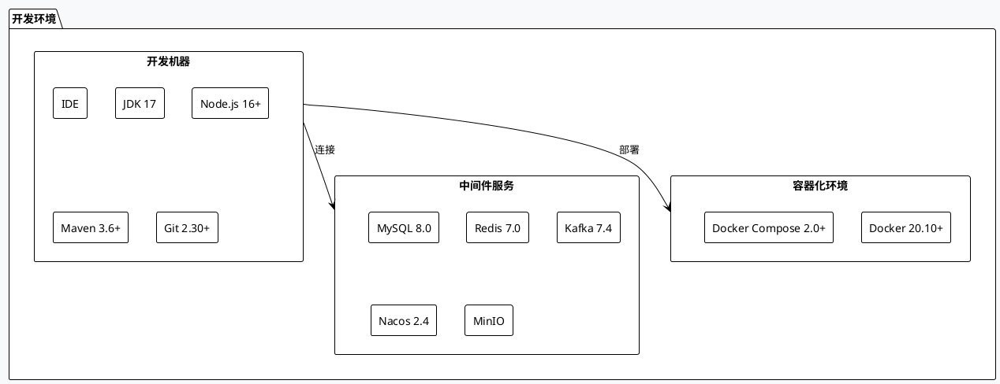

### 1.2 技术选型对比

#### 1.2.1 前端技术栈

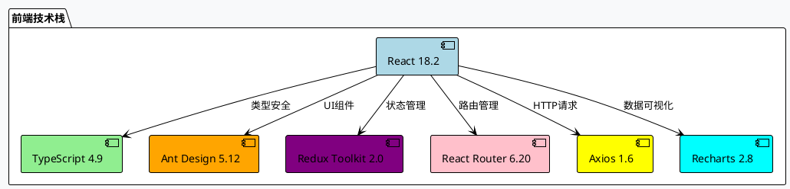

#### 1.2.2 后端技术栈

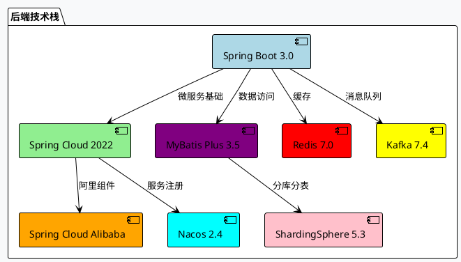

### 1.3 技术选型理由

| 技术分类 | 选择技术 | 替代方案 | 选择理由 |
|---------|---------|---------|---------|
| 前端框架 | React | Vue、Angular | 生态丰富、组件化、性能好 |
| 状态管理 | Redux Toolkit | MobX、Zustand | 可预测、工具支持、调试友好 |
| UI框架 | Ant Design | Material-UI | 组件丰富、设计规范、文档完善 |
| 后端框架 | Spring Boot | Node.js、Python | 企业级、生态成熟、微服务支持 |
| 数据库 | MySQL | PostgreSQL | 成熟稳定、性能好、社区活跃 |
| 缓存 | Redis | Memcached | 数据结构丰富、功能强大 |
| 消息队列 | Kafka | RabbitMQ | 高吞吐量、分布式、持久化 |

---

## 2. 前端实现

### 2.1 前端架构图

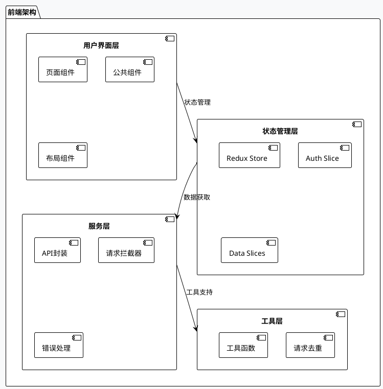

### 2.2 前端项目结构

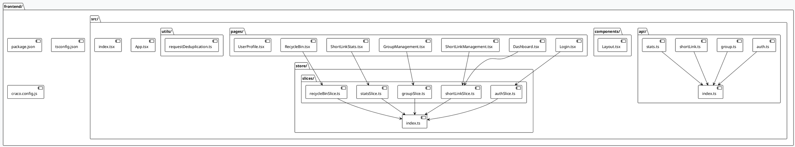

### 2.3 前端核心功能流程

#### 2.3.1 用户认证流程

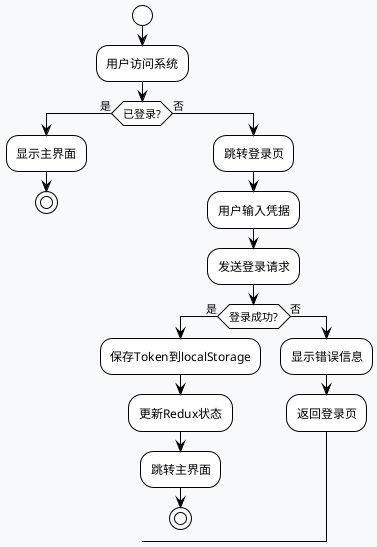

#### 2.3.2 短链接管理流程

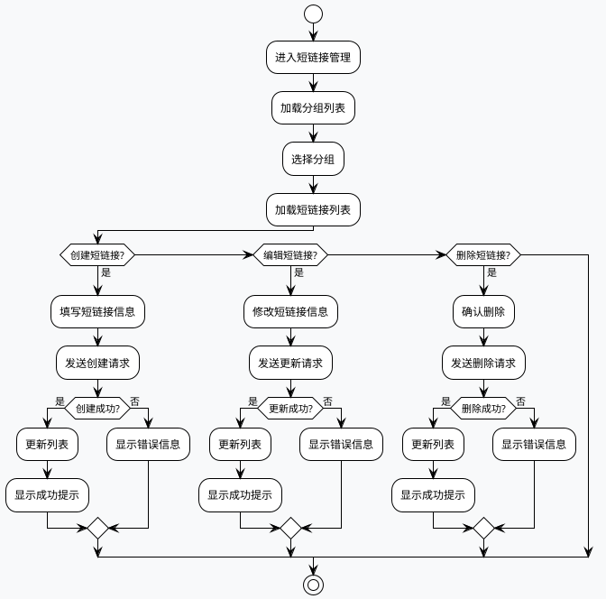

### 2.4 前端优化策略

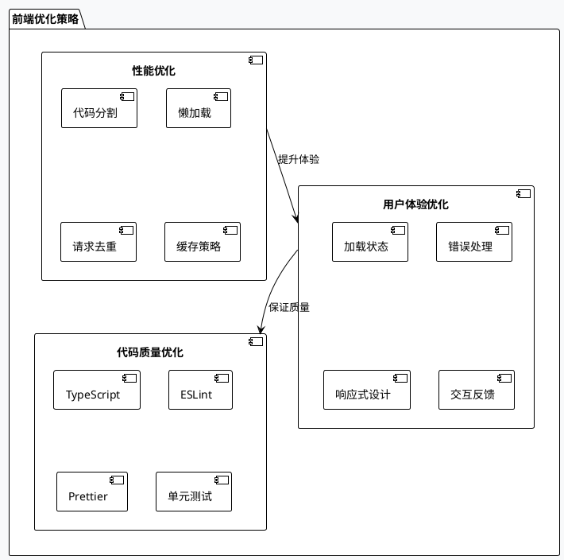

---

## 3. 后端实现

### 3.1 微服务架构图

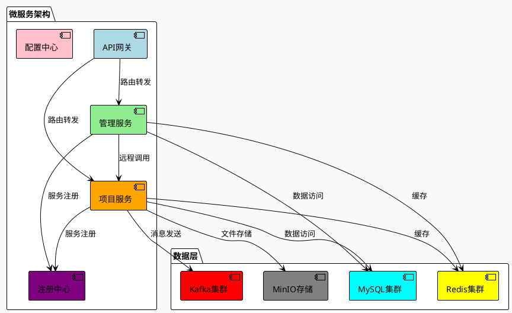

### 3.2 后端项目结构

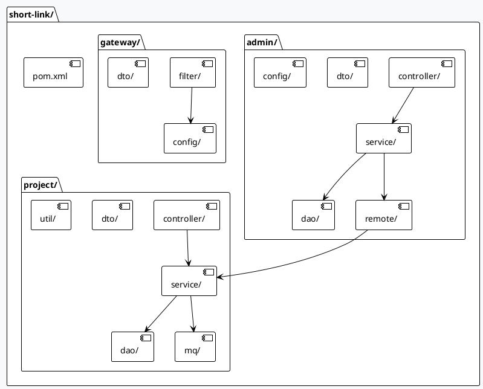

### 3.3 核心业务流程

#### 3.3.1 短链接创建流程

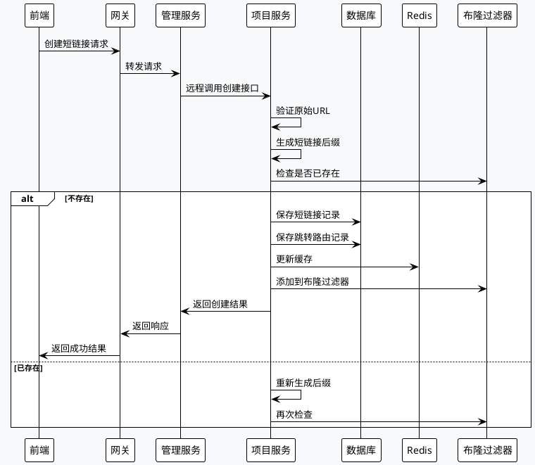

#### 3.3.2 短链接跳转流程

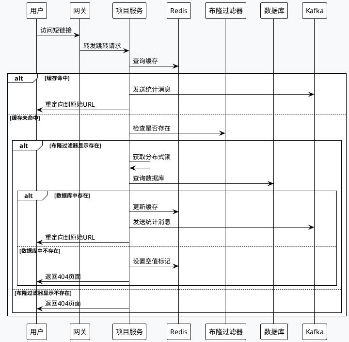

### 3.4 数据统计流程

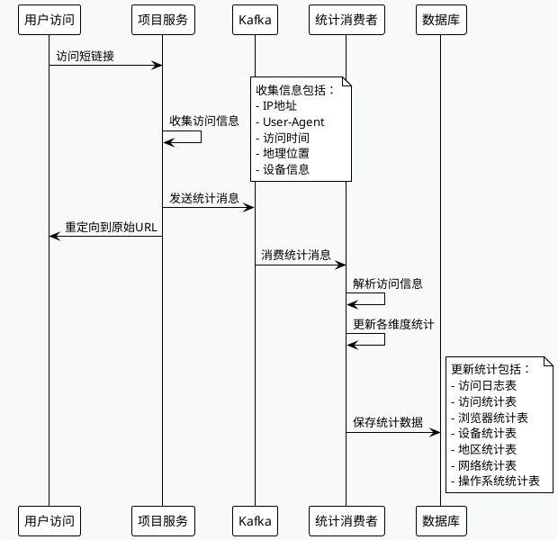

### 3.5 系统配置架构

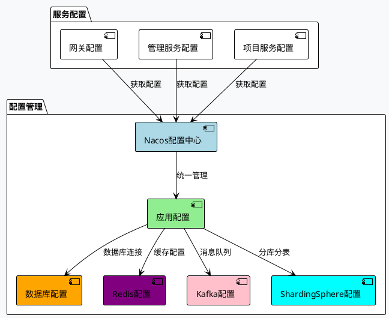

---

## 4. 部署实施

### 4.1 部署架构图

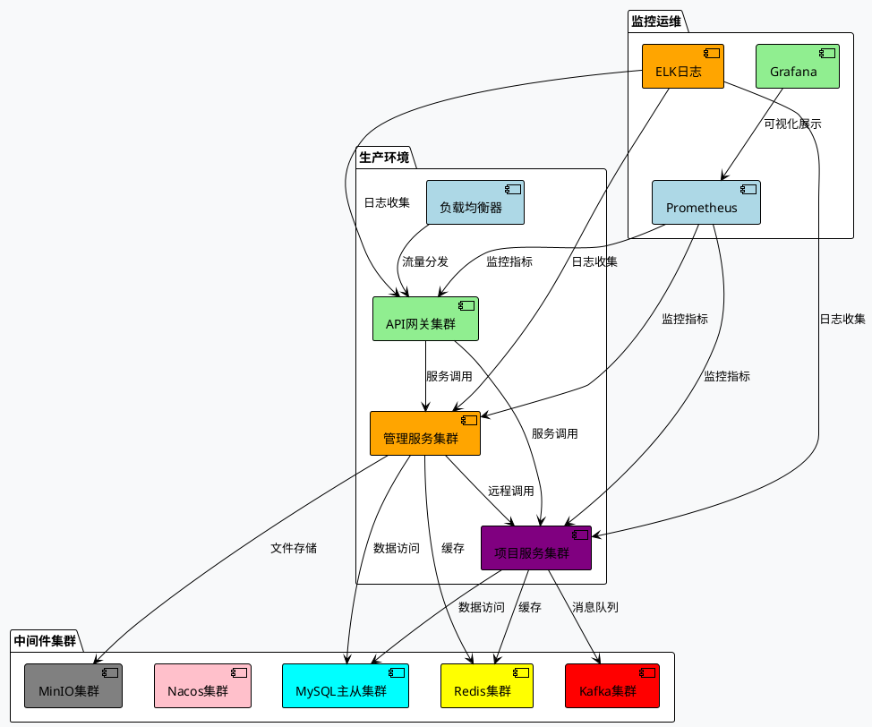

### 4.2 容器化部署流程

```plantuml
@startuml
!theme plain
skinparam backgroundColor #F8F9FA

start
:构建Docker镜像;
note right
  前端：nginx + React应用
  后端：openjdk + Spring Boot应用
end

:推送镜像到仓库;
:配置Docker Compose;
note right
  包含所有服务：
  - 前端服务
  - 后端服务
  - 数据库服务
  - 中间件服务
end

:启动容器集群;
:健康检查;
if (所有服务正常?) then (是)
  :部署完成;
  stop
else (否)
  :检查日志;
  :修复问题;
  :重新部署;
endif
@enduml
```

### 4.3 监控告警体系

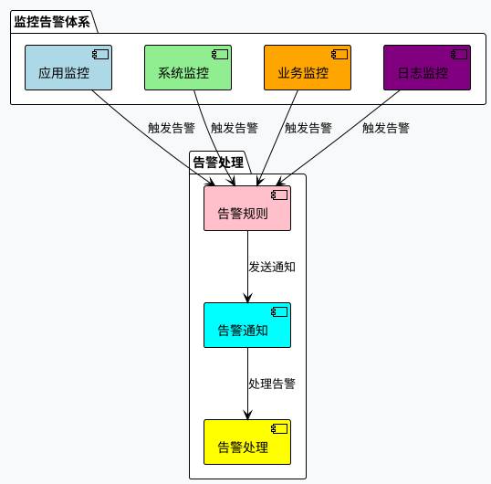

---

## 总结

本文档通过架构图、流程图和配置图，全面展示了短链接系统的实现方案：

### 主要特点

1. **图表化展示**：使用PlantUML绘制了20+个专业图表
2. **架构清晰**：从前端到后端的完整架构说明
3. **流程详细**：核心业务流程的完整流程图
4. **部署完整**：从开发到生产的完整部署方案

### 技术亮点

1. **微服务架构**：Spring Cloud + Nacos的微服务解决方案
2. **高性能设计**：Redis缓存 + Kafka异步处理
3. **分库分表**：ShardingSphere实现数据水平扩展
4. **容器化部署**：Docker + Docker Compose的容器化方案

### 系统优势

1. **高可用**：集群部署 + 负载均衡
2. **高性能**：多级缓存 + 异步处理
3. **可扩展**：微服务架构 + 分库分表
4. **易维护**：统一配置 + 监控告警

通过合理的架构设计和技术选型，实现了高性能、高可用的短链接服务系统。