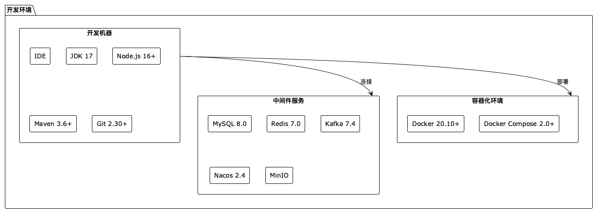
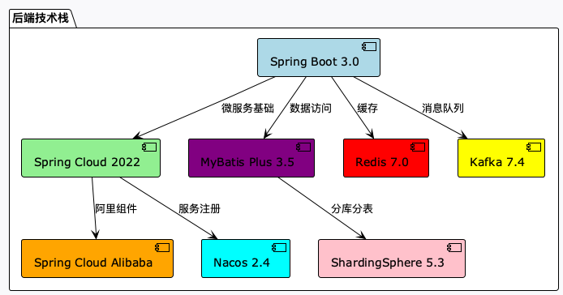
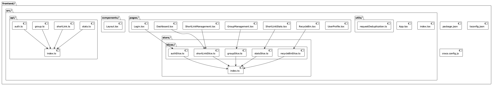
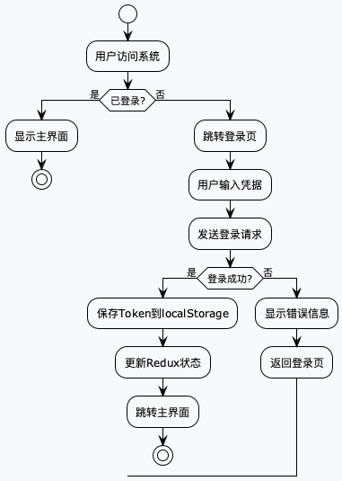
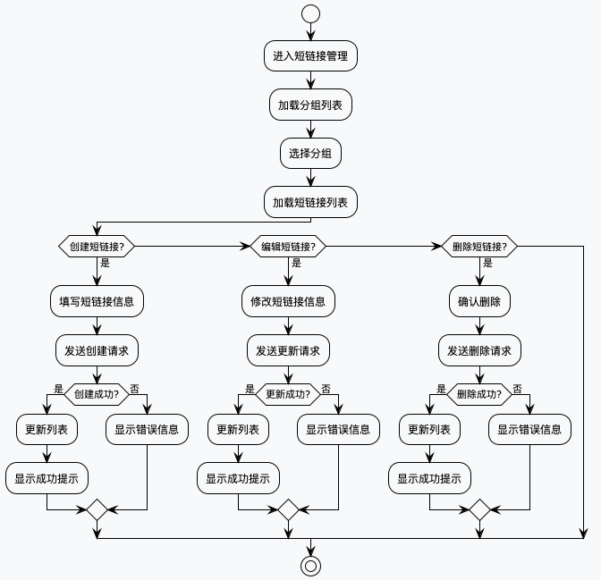
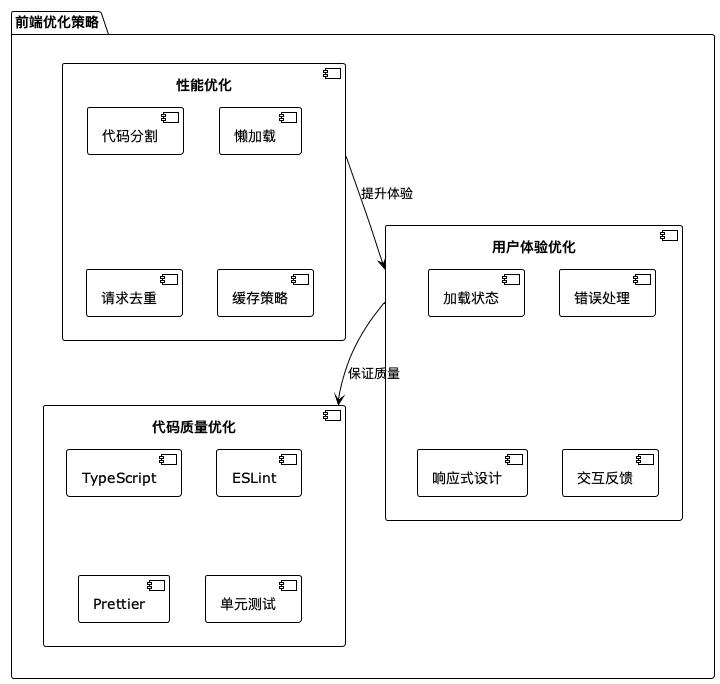
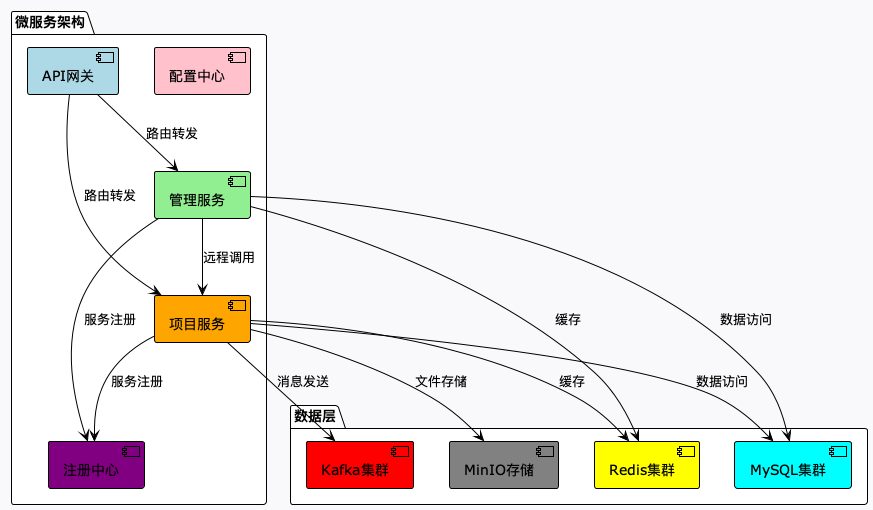
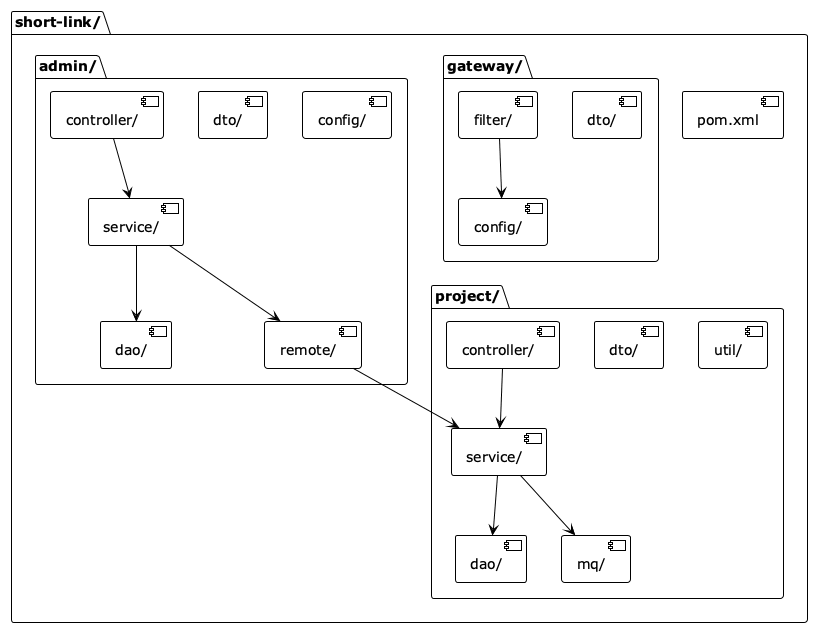

# 短链接系统实现文档

## 目录

1. [开发环境与技术选型](#1-开发环境与技术选型)
2. [前端实现](#2-前端实现)
3. [后端实现](#3-后端实现)
4. [部署实施](#4-部署实施)

---

## 1. 开发环境与技术选型

### 1.1 开发环境架构

### 1.2 技术选型对比

#### 1.2.1 前端技术栈

#### 1.2.2 后端技术栈

### 1.3 技术选型理由

| 技术分类 | 选择技术 | 替代方案 | 选择理由 |
|---------|---------|---------|---------|
| 前端框架 | React | Vue、Angular | 生态丰富、组件化、性能好 |
| 状态管理 | Redux Toolkit | MobX、Zustand | 可预测、工具支持、调试友好 |
| UI框架 | Ant Design | Material-UI | 组件丰富、设计规范、文档完善 |
| 后端框架 | Spring Boot | Node.js、Python | 企业级、生态成熟、微服务支持 |
| 数据库 | MySQL | PostgreSQL | 成熟稳定、性能好、社区活跃 |
| 缓存 | Redis | Memcached | 数据结构丰富、功能强大 |
| 消息队列 | Kafka | RabbitMQ | 高吞吐量、分布式、持久化 |

---

## 2. 前端实现

### 2.1 前端架构图

### 2.2 前端项目结构

### 2.3 前端核心功能流程

#### 2.3.1 用户认证流程

#### 2.3.2 短链接管理流程

### 2.4 前端优化策略

---

## 3. 后端实现

### 3.1 微服务架构图

### 3.2 后端项目结构

### 3.3 核心业务流程

#### 3.3.1 短链接创建流程

#### 3.3.2 短链接跳转流程

### 3.4 数据统计流程

### 3.5 系统配置架构

