# 短链接系统建模与设计文档

## 目录

1. [系统目标与框架](#1-系统目标与框架)
2. [UML建模](#2-uml建模)
   - [2.1 用例图](#21-用例图)
   - [2.2 类图](#22-类图)
   - [2.3 时序图](#23-时序图)
   - [2.4 活动图](#24-活动图)
   - [2.5 状态图](#25-状态图)
   - [2.6 组件图](#26-组件图)
   - [2.7 部署图](#27-部署图)
   - [2.8 包图](#28-包图)

---

## 1. 系统目标与框架

### 1.1 系统目标

#### 1.1.1 业务目标

**核心业务目标**
- 提供高效、稳定的短链接生成和管理服务
- 支持大规模并发访问，处理能力达到10万+ QPS
- 提供详细的访问统计和分析功能
- 保障用户数据安全和隐私保护

**扩展业务目标**
- 支持API接口调用，方便第三方集成
- 提供分组管理功能，便于链接分类
- 支持批量操作，提高管理效率
- 提供数据导出功能，支持数据分析

#### 1.1.2 技术目标

**性能目标**
- 短链接跳转响应时间 < 100ms
- 短链接创建响应时间 < 500ms
- 系统可用性达到99.9%以上
- 支持千万级数据存储

**架构目标**
- 采用微服务架构，实现服务解耦
- 支持水平扩展，提高系统弹性
- 采用分库分表，支持海量数据存储
- 实现高可用设计，保障系统稳定性

**安全目标**
- 敏感数据加密存储和传输
- 实现完善的访问控制和权限管理
- 提供安全审计和日志记录功能
- 防止常见的安全攻击（SQL注入、XSS等）

### 1.2 系统框架

#### 1.2.1 总体架构

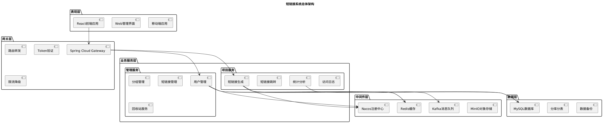

#### 1.2.2 技术架构

**前端技术栈**
- React 18.2.0 + TypeScript
- Ant Design 5.12.8
- Redux Toolkit 2.0.1
- React Router DOM 6.20.1

**后端技术栈**
- Spring Boot 3.0.7
- Spring Cloud 2022.0.3
- Spring Cloud Alibaba 2022.0.0.0-RC2
- MyBatis Plus 3.5.3.1

**中间件技术**
- Nacos 2.4.2（服务注册与配置中心）
- Redis 7（缓存）
- Kafka 7.4.0（消息队列）
- MySQL 8.0（数据库）
- ShardingSphere 5.3.2（分库分表）
- MinIO（对象存储）

#### 1.2.3 分层架构

**表现层（Presentation Layer）**
- 负责用户界面展示和交互
- 接收用户输入并调用后端接口
- 处理前端路由和状态管理

**网关层（Gateway Layer）**
- 统一入口，路由转发
- 身份认证和授权
- 限流降级和熔断

**业务服务层（Service Layer）**
- 业务逻辑处理
- 数据访问和缓存管理
- 消息队列和异步处理

**数据层（Data Layer）**
- 数据持久化存储
- 数据访问和查询优化
- 数据备份和恢复

---

## 2. UML建模

### 2.1 用例图

#### 2.1.1 系统用例图

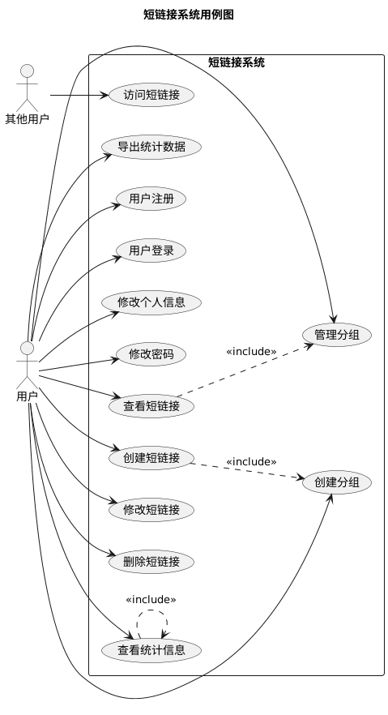

#### 2.1.2 用户管理用例图

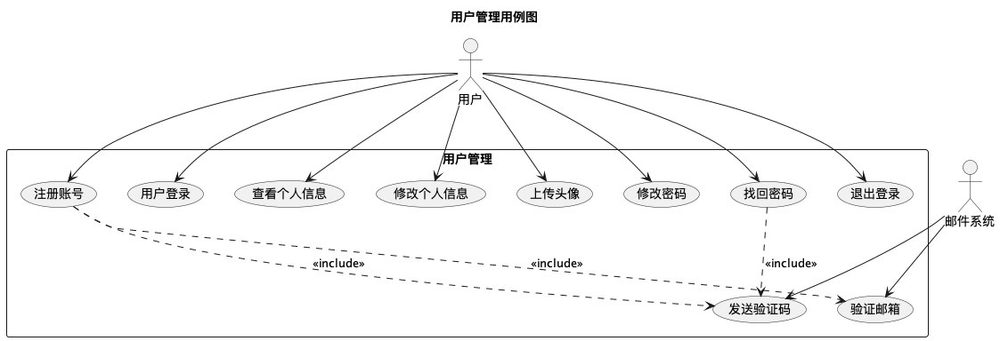

#### 2.1.3 短链接管理用例图

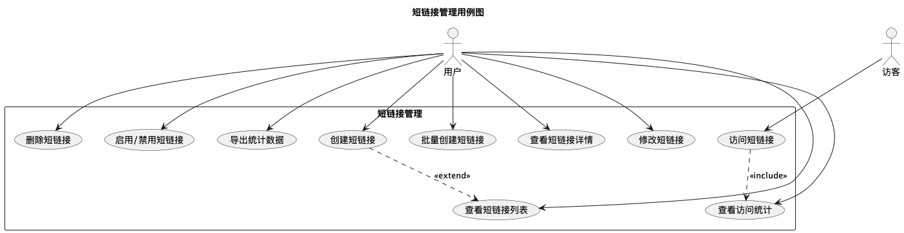

### 2.2 类图

#### 2.2.1 核心实体类图

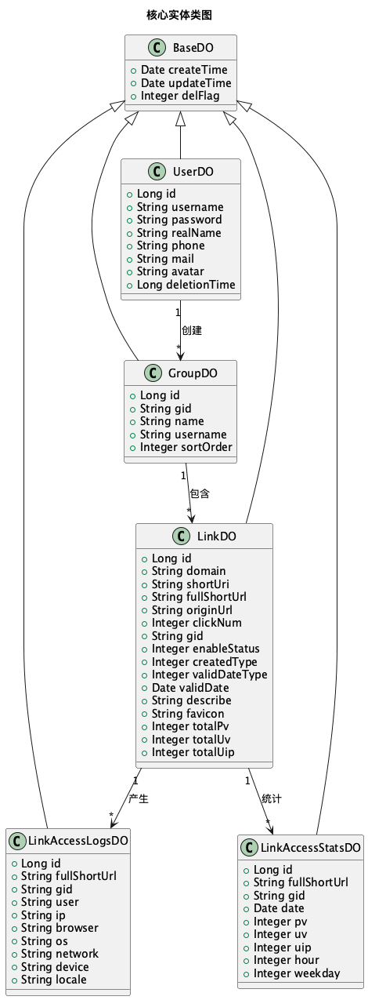

#### 2.2.2 服务层类图

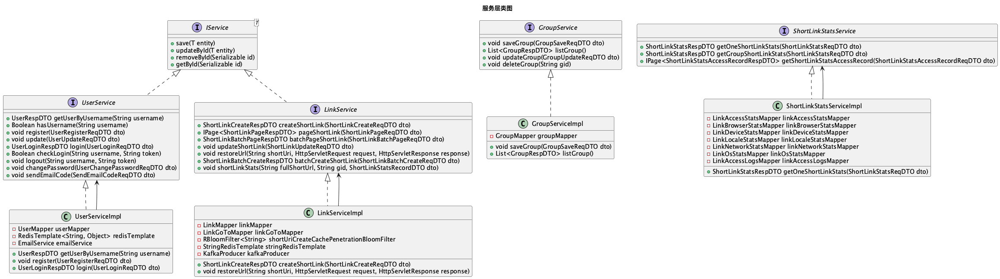

#### 2.2.3 DTO类图

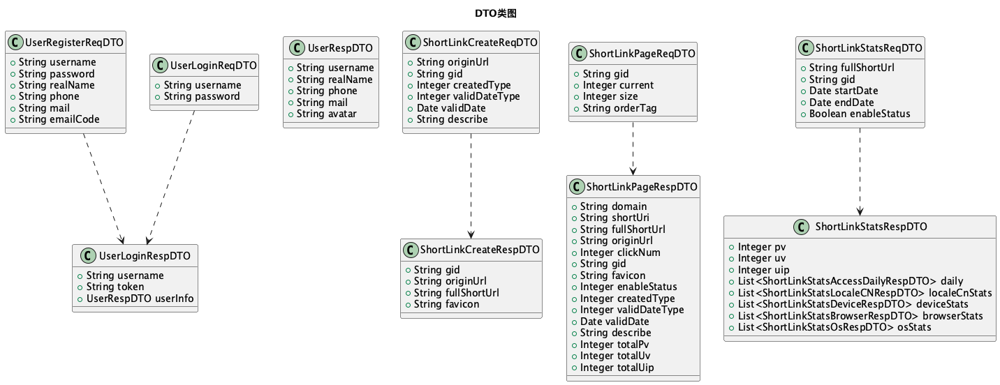

### 2.3 时序图

#### 2.3.1 用户注册时序图

#### 2.3.2 短链接创建时序图

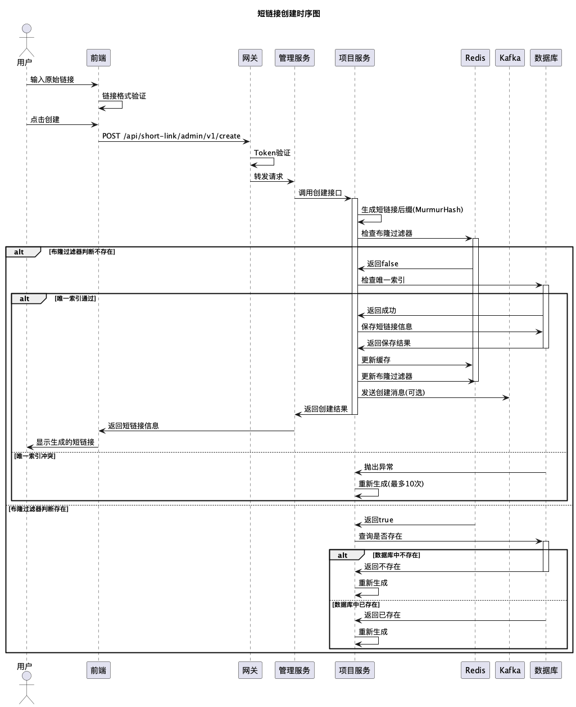

#### 2.3.3 短链接跳转时序图

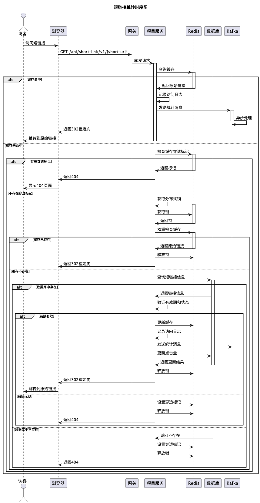

#### 2.3.4 统计数据收集时序图

### 2.4 活动图

#### 2.4.1 用户注册活动图

#### 2.4.2 短链接创建活动图

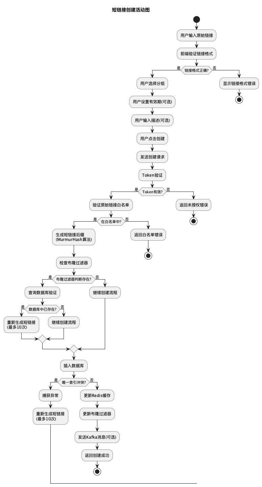

#### 2.4.3 短链接跳转活动图

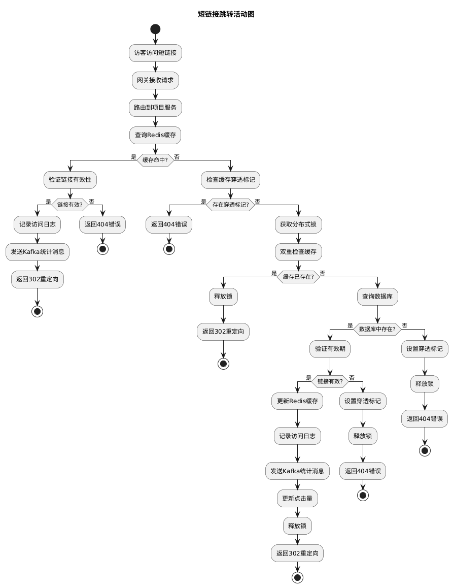

### 2.5 状态图

#### 2.5.1 短链接状态图

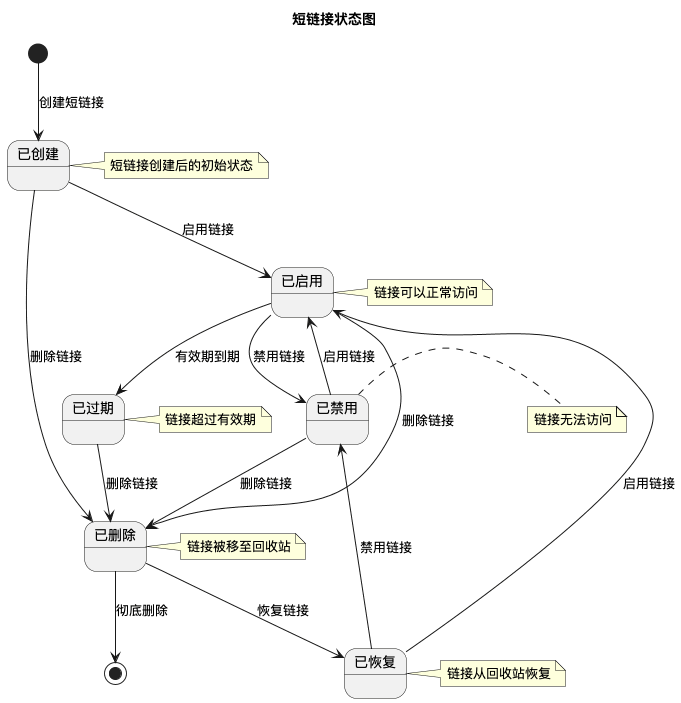

#### 2.5.2 用户账户状态图

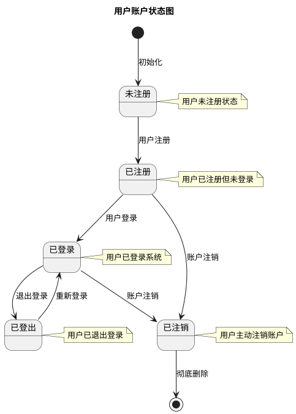

### 2.6 组件图

#### 2.6.1 系统组件图

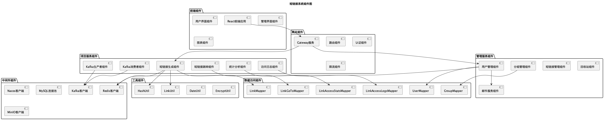

### 2.7 部署图

#### 2.7.1 系统部署图

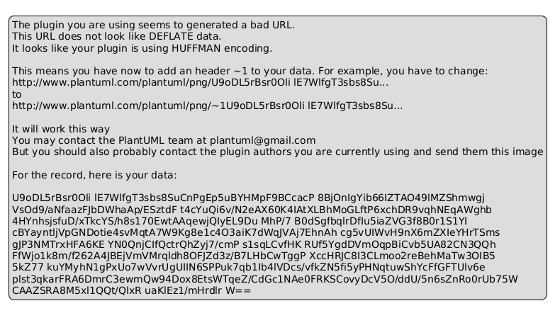

#### 2.7.2 容器化部署图

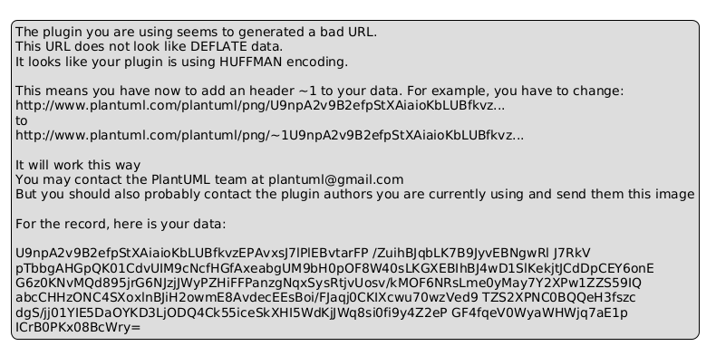

### 2.8 包图

#### 2.8.1 管理服务包图

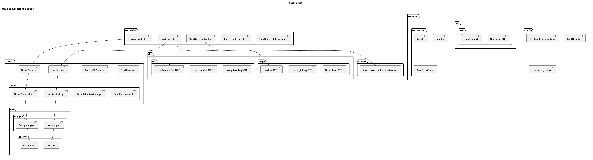

#### 2.8.2 项目服务包图

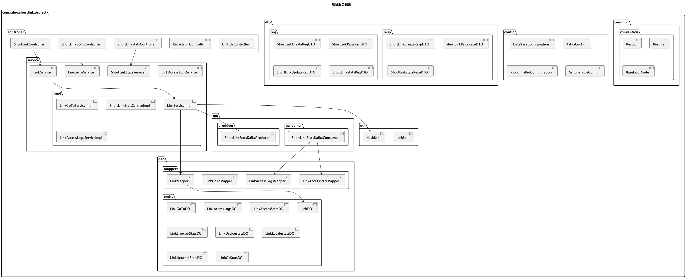

#### 2.8.3 网关服务包图

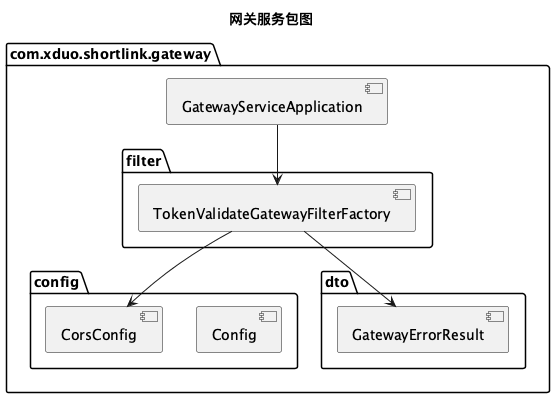

---

## 总结

本文档详细描述了短链接系统的建模与设计，包括：

1. **系统目标与框架**：明确了系统的业务目标、技术目标和架构框架
2. **UML建模**：提供了完整的UML建模图，包括：
   - **用例图**：描述了系统的功能需求和用户交互
   - **类图**：展示了系统的静态结构和类之间的关系
   - **时序图**：描述了系统动态交互过程
   - **活动图**：展示了业务流程和活动流程
   - **状态图**：描述了对象的状态转换
   - **组件图**：展示了系统的组件结构和依赖关系
   - **部署图**：展示了系统的部署架构和硬件配置
   - **包图**：展示了系统的包结构和模块划分

这些UML图从不同角度全面描述了系统的设计和实现，为系统的开发、维护和扩展提供了重要的参考依据。
