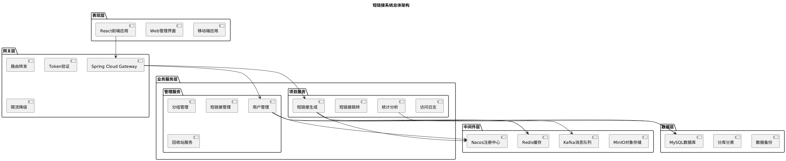
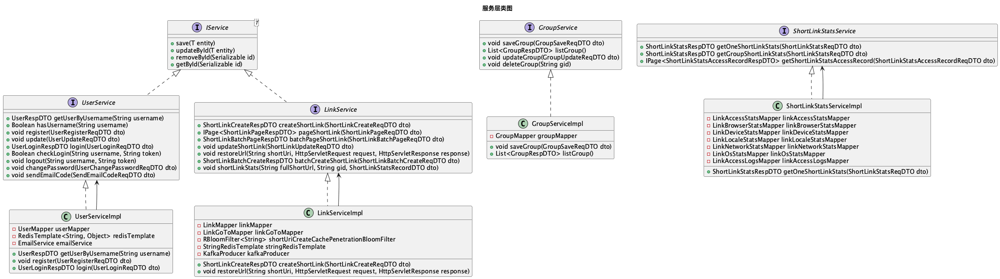
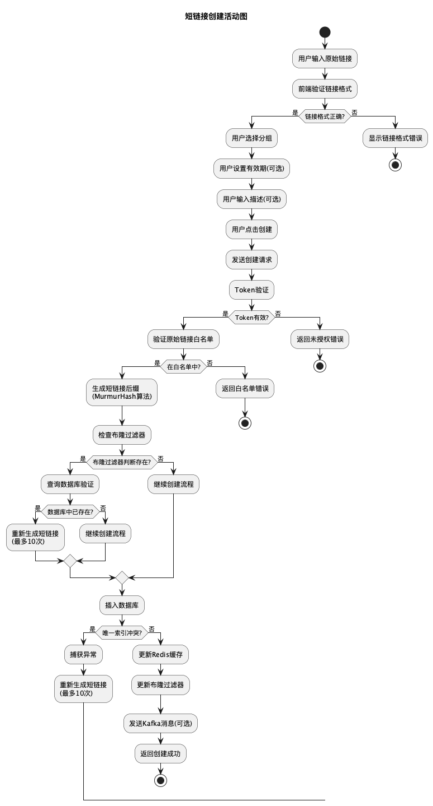
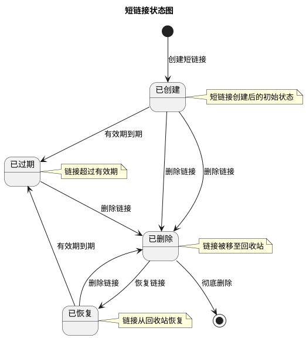
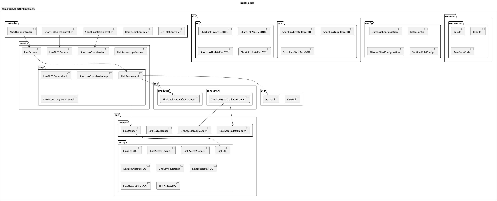

# 项目报告

项目代码已开源：https://github.com/xDuoooo/short-link

## 项目背景与意义

### 项目背景

在当今数字化时代，互联网已经成为人们获取信息、进行商业活动的重要平台。随着社交媒体、移动应用和电子商务的快速发展，长链接（URL）在分享和传播过程中面临着诸多挑战：

#### 长链接存在的问题

- **长度限制**：社交媒体平台（如Twitter、微博）对字符数有严格限制，长链接占用大量字符空间
- **用户体验差**：长链接包含大量参数和路径，用户难以记忆和手动输入
- **视觉污染**：在文本内容中，长链接影响阅读体验和美观度
- **统计困难**：原始链接如果不支持访问统计和分析数据的话，则不能进行分析与统计

#### 短链接的价值

- **美观与便捷**：在社交媒体（如微博）、短信、二维码等对字符长度有限制的场景下，短链接是刚需。它更易于分享、打印和口头传播，用户也更不容易输错。
- **数据追踪与分析**：这是短链接一个非常核心的商业价值。通过在短链接的重定向上增加统计逻辑，我们可以追踪到链接的点击次数、点击来源、用户地域分布、设备信息等，为运营决策和广告效果衡量提供精准的数据支持。
- **功能扩展**：短链接可以作为一层中间代理，在这层代理上我们可以实现很多高级功能，比如链接的有效期控制、访问密码保护、设备跳转控制（移动端和PC端访问跳转到不同页面）等。
- **隐藏原始链接**：在某些推广场景下，可以隐藏真实的、带有复杂参数的原始URL。
- **节约资金**：手机发送短信是按字符计费的，节约字符数，可以节约一笔钱

#### 市场需求分析

根据市场调研数据显示：

- **全球短链接服务市场规模**：预计2024年将达到15亿美元，年复合增长率超过20%
- **用户需求增长**：社交媒体用户数量持续增长，对短链接服务的需求同步上升
- **企业应用需求**：营销推广、数据分析、品牌保护等企业级需求日益增长
- **移动互联网发展**：移动设备普及使得短链接在移动应用中的重要性更加突出


### 项目意义

#### 技术意义

**1. 微服务架构实践**
- 采用Spring Cloud微服务架构，实现服务解耦和水平扩展
- 通过Nacos实现服务注册与发现，提高系统可用性
- 使用ShardingSphere实现分库分表，支持海量数据存储

**2. 高并发处理能力**
- 基于Redis缓存和布隆过滤器，实现高性能短链接跳转
- 使用Kafka消息队列异步处理统计数据，提升系统吞吐量
- 通过Sentinel实现限流降级，保障系统稳定性

**3. 数据安全与隐私保护**
- 敏感数据（手机号、邮箱、密码）采用AES加密存储
- 实现用户流量风控，防止恶意攻击
- 支持域名白名单机制，防止恶意跳转

#### 商业意义

**1. 降低运营成本**
- 通过自动化短链接生成和管理，减少人工操作成本
- 提供详细的访问统计，帮助企业优化营销策略
- 支持批量操作，提高工作效率

**2. 提升用户体验**
- 简洁的短链接提升分享体验
- 实时统计数据分析，帮助用户了解链接传播效果
- 支持分组管理，便于链接分类和整理

**3. 数据价值挖掘**
- 收集访问数据，提供地域、设备、浏览器等多维度分析
- 支持实时监控和历史数据查询
- 为企业决策提供数据支持

#### 社会意义

**1. 促进信息传播**
- 降低信息分享门槛，促进优质内容传播
- 支持社交媒体内容优化，提升传播效率
- 为公益组织和教育机构提供免费服务

**2. 推动技术发展**
- 展示现代微服务架构的最佳实践
- 为开源社区贡献高质量代码
- 促进分布式系统技术普及

**3. 数据安全示范**

- 展示数据加密和隐私保护技术
- 提供安全开发实践参考
- 推动行业安全标准建立

## 系统可行性分析

### 经济可行性分析

#### 收益分析

**直接收益**
- **付费服务**：高级功能、API调用、数据导出等付费服务
- **广告收入**：在管理界面投放相关广告
- **企业服务**：为企业客户提供定制化解决方案

**间接收益**
- **数据价值**：匿名化访问数据可用于市场研究
- **品牌价值**：技术品牌建设和行业影响力
- **生态价值**：构建短链接服务生态圈

**收益预测**

- **第一年**：用户增长期，主要投入，收益有限
- **第二年**：用户规模扩大，开始盈利
- **第三年**：稳定盈利

#### 投资回报分析

**ROI计算**
- **投资回收期**：预计18-24个月
- **内部收益率（IRR）**：预计25-40%

**风险控制**
- **分阶段投资**：根据用户增长情况分阶段投入
- **成本控制**：采用云服务，按需付费
- **收入多元化**：多种收入来源降低风险

### 技术可行性分析

#### 技术架构可行性

**微服务架构**
- **技术成熟度**：Spring Cloud生态成熟，社区活跃
- **开发难度**：团队具备相关技术栈经验
- **维护成本**：通过容器化部署，降低运维复杂度

**数据库设计**
- **分库分表**：ShardingSphere技术成熟，支持水平扩展
- **数据一致性**：通过分布式事务保证数据一致性
- **性能优化**：索引优化和查询优化提升性能

**缓存策略**
- **Redis集群**：支持高可用和水平扩展
- **缓存一致性**：通过缓存更新策略保证数据一致性
- **性能提升**：缓存命中率预计达到90%以上

#### 性能可行性

**并发处理能力**
- **短链接跳转**：单机QPS预计10000+，集群QPS预计100000+
- **数据写入**：通过批量写入和异步处理，支持高并发写入
- **查询性能**：通过索引优化，查询响应时间<100ms

**扩展性设计**
- **水平扩展**：服务无状态设计，支持水平扩展
- **数据库扩展**：分库分表支持数据水平扩展
- **缓存扩展**：Redis集群支持缓存水平扩展

**可用性保障**
- **服务降级**：通过Sentinel实现服务降级
- **故障恢复**：自动故障检测和恢复机制
- **数据备份**：定期数据备份和恢复策略

#### 安全可行性

**数据安全**
- **加密存储**：敏感数据AES加密存储
- **传输安全**：可用HTTPS加密传输
- **访问控制**：基于Session的身份认证和授权

**系统安全**
- **输入验证**：严格的输入验证和过滤
- **SQL注入防护**：使用参数化查询防止SQL注入
- **XSS防护**：输出编码防止XSS攻击

**运维安全**

- **日志审计**：后期可添加完整的操作日志记录
- **监控告警**：实时监控和异常告警
- **安全扫描**：定期安全漏洞扫描

### 法律可行性分析

#### 数据保护法规

**个人信息保护法**
- **数据收集**：明确告知用户数据收集目的和范围
- **数据使用**：仅在授权范围内使用用户数据
- **数据存储**：采用加密存储保护用户隐私
- **数据删除**：提供数据删除和注销功能

**网络安全法**
- **数据本地化**：用户数据存储在中国境内
- **安全等级保护**：按照等保要求进行安全建设
- **数据出境**：严格控制数据出境，符合法规要求

#### 知识产权保护

**开源协议**
- **技术栈**：使用Apache等开源技术栈
- **代码开源**：核心代码开源，促进技术交流
- **专利保护**：申请相关技术专利保护

**商标保护**
- **品牌注册**：注册相关商标和域名
- **版权保护**：软件著作权登记
- **商业秘密**：核心算法和商业策略保护

#### 合规要求

**ICP备案**
- **网站备案**：完成ICP备案和ICP经营许可证申请
- **域名备案**：相关域名完成备案
- **服务器备案**：服务器所在地备案

**行业规范**
- **短链接服务规范**：遵循行业最佳实践
- **数据安全标准**：符合国家数据安全标准
- **服务质量标准**：建立服务质量保障体系

### 政策可行性分析

#### 国家政策支持

**数字经济发展**
- **政策支持**：国家大力支持数字经济发展
- **技术创新**：鼓励技术创新和产业升级
- **人才培养**：支持技术人才培养和引进

**互联网+战略**
- **产业融合**：促进互联网与传统产业融合
- **服务创新**：鼓励互联网服务创新
- **平台建设**：支持互联网平台建设

#### 行业政策环境

**短链接服务**
- **行业规范**：短链接服务行业逐步规范化
- **技术标准**：相关技术标准逐步完善
- **监管要求**：监管要求逐步明确

**数据安全**
- **数据安全法**：数据安全法为数据保护提供法律依据
- **个人信息保护**：个人信息保护法加强隐私保护
- **网络安全**：网络安全法保障网络安全

#### 政策风险分析

**监管变化**
- **政策调整**：关注相关政策变化和调整
- **合规要求**：及时调整合规策略
- **风险应对**：建立政策风险应对机制

**行业准入**
- **资质要求**：了解行业准入资质要求
- **许可申请**：及时申请相关许可和资质
- **合规经营**：确保合规经营

---

## 系统需求分析

### 总体需求分析

#### 业务需求

**核心业务需求**
- **短链接生成**：支持将长链接转换为短链接
- **短链接跳转**：用户访问短链接时重定向到原始链接
- **链接管理**：支持短链接的增删改查操作
- **统计分析**：提供详细的访问统计和分析数据
- **用户管理**：支持用户注册、登录、权限管理

**扩展业务需求**
- **分组管理**：支持短链接分组管理
- **回收站功能**：支持软删除和恢复功能
- **批量操作**：支持批量创建、修改、删除短链接（TODO）
- **API服务**：提供RESTful API供第三方调用
- **数据导出**：支持统计数据导出功能

#### 功能需求

**用户功能需求**
- **注册登录**：支持邮箱注册和密码登录
- **个人信息管理**：支持个人信息修改和头像上传
- **密码管理**：支持密码修改和找回功能
- **短链接创建**：支持单个和批量创建短链接
- **短链接管理**：支持短链接的查看、修改、删除
- **统计分析**：查看短链接的访问统计数据
- **分组管理**：创建和管理短链接分组


#### 非功能需求

**性能需求**
- **响应时间**：短链接跳转响应时间<100ms
- **并发处理**：支持10000+并发用户访问
- **数据处理**：支持百万级短链接数据存储
- **可用性**：系统可用性达到99.9%以上

**安全需求**
- **数据加密**：敏感数据加密存储和传输
- **身份认证**：基于Session的身份认证机制
- **安全审计**：完整的操作日志和审计功能（TODO）

**可扩展性需求**
- **水平扩展**：支持服务实例水平扩展
- **数据扩展**：支持数据库分库分表扩展
- **功能扩展**：支持新功能模块的快速集成

### 功能概述

#### 用户管理模块

**用户注册功能**
- 支持邮箱验证码注册
- 用户名唯一性验证
- 密码强度验证
- 注册信息加密存储

**用户登录功能**
- 用户名密码登录
- Token身份认证
- 登录状态保持

**个人信息管理**

- 个人信息查看和修改
- 头像上传和管理
- 密码修改功能
- 账户注销功能

#### 短链接管理模块

**短链接生成**
- 基于MurmurHash算法生成6位短链接
- 布隆过滤器防重复机制
- 支持批量生成短链接

**短链接跳转**
- 高性能跳转服务
- Redis缓存优化
- 缓存穿透保护
- 缓存击穿保护

**短链接管理**
- 短链接列表查看
- 短链接信息修改
- 短链接状态管理
- 短链接删除和恢复

#### 分组管理模块

**分组创建**
- 支持自定义分组名称
- 分组排序功能

**分组管理**
- 分组列表查看
- 分组信息修改
- 分组删除功能
- 分组内短链接管理

#### 统计分析模块

**基础统计**
- 访问量（PV）统计
- 独立访客（UV）统计
- 独立IP（UIP）统计
- 实时统计数据

**多维度统计**
- 地域统计分析
- 设备类型统计
- 浏览器统计
- 操作系统统计
- 网络类型统计

**数据可视化**
- 图表展示统计结果

#### 回收站模块

**软删除功能**
- 短链接软删除
- 删除时间记录

**恢复功能**
- 单个恢复功能

**彻底删除**

- 永久删除功能

---

#### 接口文档

##### Admin模块 - 用户管理

- `POST /api/short-link/admin/v1/user` - 注册用户
- `GET /api/short-link/admin/v1/user/{username}` - 根据用户名查询用户信息
- `GET /api/short-link/admin/v1/actual/user/{username}` - 根据用户名查询真实用户信息(无脱敏)
- `GET /api/short-link/admin/v1/user/has-username` - 检查用户名是否存在
- `PUT /api/short-link/admin/v1/user` - 修改用户信息
- `POST /api/short-link/admin/v1/user/login` - 用户登录
- `POST /api/short-link/admin/v1/user/change-password` - 修改密码
- `POST /api/short-link/admin/v1/user/send-email-code` - 发送邮箱验证码
- `POST /api/short-link/admin/v1/user/send-register-email-code` - 发送注册邮箱验证码
- `POST /api/short-link/admin/v1/user/send-change-email-code` - 发送变更邮箱验证码
- `GET /api/short-link/admin/v1/user/check-login` - 检查用户是否登录
- `DELETE /api/short-link/admin/v1/user/check-login` - 用户退出登录
- `POST /api/short-link/admin/v1/user/send-forgot-password-email-code` - 发送找回密码邮箱验证码
- `POST /api/short-link/admin/v1/user/forgot-password` - 找回密码
- `POST /api/short-link/admin/v1/user/change-email` - 变更邮箱
- `POST /api/short-link/admin/v1/avatar/upload` - 上传头像

---

##### Admin模块 - 分组管理

- `POST /api/short-link/admin/v1/group` - 新增短链接分组
- `GET /api/short-link/admin/v1/group` - 获取短链接分组列表
- `PUT /api/short-link/admin/v1/group` - 短链接分组修改
- `DELETE /api/short-link/admin/v1/group` - 短链接分组删除
- `POST /api/short-link/admin/v1/group/sort` - 短链接分组排序

---

##### Admin模块 - 短链接管理

- `POST /api/short-link/admin/v1/create` - 创建短链接
- `POST /api/short-link/admin/v1/update` - 修改短链接
- `GET /api/short-link/admin/v1/page` - 分页查询短链接
- `POST /api/short-link/admin/v1/page/batch` - 批量分页查询短链接
- `GET /api/short-link/admin/v1/count` - 查询短链接分组下短链接数量

---

##### Admin模块 - 回收站管理

- `POST /api/short-link/admin/v1/recycle-bin/save` - 短链接移至回收站
- `GET /api/short-link/admin/v1/recycle-bin/page` - 分页查询回收站里的短链接(当前用户)
- `POST /api/short-link/admin/v1/recycle-bin/recover` - 短链接移出回收站
- `POST /api/short-link/admin/v1/recycle-bin/remove` - 短链接彻底删除

---

##### Admin模块 - 短链接统计

- `GET /api/short-link/admin/v1/stats` - 访问单个短链接指定时间内监控数据
- `GET /api/short-link/admin/v1/stats/group` - 访问分组短链接指定时间内监控数据
- `GET /api/short-link/admin/v1/stats/access-record` - 访问单个短链接指定时间内访问记录监控数据
- `GET /api/short-link/admin/v1/stats/access-record/group` - 访问分组短链接指定时间内访问记录监控数据

---

##### Admin模块 - URL标题

- `GET /api/short-link/admin/v1/title` - 根据URL获取对应网站的标题

---

##### Project模块 - 短链接管理

- `GET /api/short-link/v1/{short-uri}` - 短网址跳转
- `POST /api/short-link/v1/create` - 创建短链接
- `POST /api/short-link/v1/update` - 修改短链接
- `POST /api/short-link/v1/page` - 分页查询短链接请求
- `POST /api/short-link/v1/page/batch` - 批量分页查询短链接请求
- `GET /api/short-link/v1/count` - 查询短链接分组下短链接数量

---

##### Project模块 - 回收站管理

- `POST /api/short-link/v1/recycle-bin/save` - 保存短链接到回收站
- `GET /api/short-link/v1/recycle-bin/page` - 分页查询回收站里的短链接请求
- `POST /api/short-link/v1/recycle-bin/recover` - 恢复回收站中的短链接
- `POST /api/short-link/v1/recycle-bin/remove` - 删除回收站中的短链接

---

##### Project模块 - 短链接统计

- `GET /api/short-link/v1/stats` - 获取一个短链接指定日期内监控统计数据
- `GET /api/short-link/v1/stats/group` - 获取一组短链接指定日期内监控统计数据
- `GET /api/short-link/v1/stats/access-record` - 访问单个短链接指定时间内访问记录监控数据
- `GET /api/short-link/v1/stats/access-record/group` - 访问一组短链接指定时间内访问记录监控数据
- `GET /api/short-link/v1/stats/access-record/export` - 导出短链接访问记录(Excel)

---

##### Project模块 - URL标题

- `GET /api/short-link/v1/title` - 根据URL获取对应网站的标题

---

##### Project模块 - 短链接跳转

- `GET /{short-uri}` - 短网址跳转

---

## 说明

- Admin模块接口前缀：`/api/short-link/admin/v1`
- Project模块接口前缀：`/api/short-link/v1`
- 所有接口统一返回格式：`Result<T>`
- 日期格式参考具体接口的DTO定义
- 需要认证的接口请携带相应的Token

#### 数据格式设计

**分页格式**

```json
{
  "code": 0,
  "message": "success",
  "data": {
    "records": [],
    "total": 100,
    "current": 1,
    "size": 10
  },
  "requestId": "uuid"
}
```

### 业务流程分析

#### 用户注册流程


#### 短链接创建流程


#### 短链接跳转流程


#### 统计数据收集流程


#### 系统架构图


### 性能需求分析

#### 响应时间要求

- **短链接跳转**：< 100ms
- **短链接创建**：< 500ms
- **数据查询**：< 200ms
- **用户登录**：< 300ms
- **统计查询**：< 1000ms

#### 并发处理要求

- **短链接跳转**：10000+ QPS
- **短链接创建**：1000+ QPS
- **数据查询**：5000+ QPS
- **用户登录**：100+ QPS
- **统计查询**：100+ QPS

#### 数据存储要求

- **短链接数据**：支持千万级数据存储
- **访问日志**：支持亿级数据存储
- **统计数据**：支持千万级统计数据
- **用户数据**：支持百万级用户数据

### 安全需求分析

- **敏感数据加密**：手机号、邮箱、密码AES加密存储
- **身份认证**：基于Token的身份认证
- **权限控制**：基于角色的访问控制
- **接口限流**：防止恶意请求和DDoS攻击
- **输入验证**：严格的输入验证和过滤
  
---

## 系统建模与分析

### 系统目标与框架

#### 系统目标

##### 业务目标

**核心业务目标**
- 提供高效、稳定的短链接生成和管理服务
- 支持大规模并发访问，处理能力达到10万+ QPS
- 提供详细的访问统计和分析功能
- 保障用户数据安全和隐私保护

**扩展业务目标**
- 支持API接口调用，方便第三方集成
- 提供分组管理功能，便于链接分类
- 支持批量操作，提高管理效率
- 提供数据导出功能，支持数据分析

##### 技术目标

**性能目标**
- 短链接跳转响应时间 < 100ms
- 短链接创建响应时间 < 500ms
- 系统可用性达到99.9%以上
- 支持千万级数据存储

**架构目标**
- 采用微服务架构，实现服务解耦
- 支持水平扩展，提高系统弹性
- 采用分库分表，支持海量数据存储
- 实现高可用设计，保障系统稳定性

**安全目标**
- 敏感数据加密存储和传输
- 实现完善的访问控制和权限管理
- 提供安全审计和日志记录功能
- 防止常见的安全攻击（SQL注入、XSS等）

#### 系统框架

##### 总体架构



##### 技术架构

**前端技术栈**
- React 18.2.0 + TypeScript
- Ant Design 5.12.8
- Redux Toolkit 2.0.1
- React Router DOM 6.20.1

**后端技术栈**
- Spring Boot 3.0.7
- Spring Cloud 2022.0.3
- Spring Cloud Alibaba 2022.0.0.0-RC2
- MyBatis Plus 3.5.3.1

**中间件技术**
- Nacos 2.4.2（服务注册与配置中心）
- Redis 7（缓存）
- Kafka 7.4.0（消息队列）
- MySQL 8.0（数据库）
- ShardingSphere 5.3.2（分库分表）
- MinIO（对象存储）

##### 分层架构

**表现层（Presentation Layer）**
- 负责用户界面展示和交互
- 接收用户输入并调用后端接口
- 处理前端路由和状态管理

**网关层（Gateway Layer）**
- 统一入口，路由转发
- 身份认证和授权
- 限流降级和熔断

**业务服务层（Service Layer）**
- 业务逻辑处理
- 数据访问和缓存管理
- 消息队列和异步处理

**数据层（Data Layer）**
- 数据持久化存储
- 数据访问和查询优化
- 数据备份和恢复

---

### UML建模

#### 用例图

##### 系统用例图


#### 类图

##### 核心实体类图


##### 服务层类图



##### DTO类图


#### 时序图

##### 用户注册时序图


##### 短链接创建时序图


##### 短链接跳转时序图


##### 统计数据收集时序图


#### 活动图

##### 用户注册活动图


##### 短链接创建活动图



##### 短链接跳转活动图


#### 状态图

##### 短链接状态图



##### 用户账户状态图


#### 组件图

##### 系统组件图


#### 包图

##### 管理服务包图


##### 项目服务包图



##### 网关服务包图


---

## 数据库设计

### 数据库选型

**主数据库**：MySQL 8.0

- 支持高并发读写
- 完善的事务支持
- 丰富的索引类型
- 良好的分库分表支持

**缓存数据库**：Redis 7
- 高性能内存存储
- 支持多种数据结构
- 持久化支持
- 集群模式支持

### 设计原则

**1. 数据一致性**
- 使用事务保证数据一致性
- 采用分布式事务处理跨表操作
- 实现最终一致性机制

**2. 高性能**
- 分库分表支持水平扩展
- 合理的索引设计
- 读写分离架构

**3. 高可用**
- 主从复制架构
- 自动故障转移
- 数据备份和恢复

**4. 数据安全**
- 敏感数据加密存储
- 访问权限控制
- 审计日志记录

### 命名规范

**表命名规范**
- 表名使用小写字母和下划线
- 分表使用 `_数字` 后缀
- 示例：`t_user_0`, `t_link_1`

**字段命名规范**
- 字段名使用小写字母和下划线
- 主键统一使用 `id`
- 外键使用 `_id` 后缀
- 时间字段使用 `_time` 后缀

**索引命名规范**
- 主键索引：`PRIMARY`
- 唯一索引：`idx_unique_字段名`
- 普通索引：`idx_字段名`
- 复合索引：`idx_字段1_字段2`

---

### 分库分表策略

#### 分片策略

**分片算法**：HASH_MOD（取模算法）
- 根据分片键计算哈希值
- 对分表数量取模得到分表编号
- 保证数据分布均匀

**分片键选择**
- 用户表：`username`（用户名）
- 分组表：`username`（用户名）
- 短链接表：`gid`（分组标识）
- 跳转表：`full_short_url`（完整短链接）
- 访问日志表：`gid`（分组标识）
- 统计表：`gid`（分组标识）

#### 分表配置

| 表名 | 分表数量 | 分片键 | 说明 |
|------|---------|--------|------|
| t_user | 16 | username | 用户表 |
| t_group | 16 | username | 分组表 |
| t_link | 16 | gid | 短链接表 |
| t_link_goto | 16 | full_short_url | 跳转路由表 |
| t_link_access_logs | 64 | gid | 访问日志表 |
| t_link_access_stats | 32 | gid | 访问统计表 |
| t_link_browser_stats | 16 | gid | 浏览器统计表 |
| t_link_device_stats | 16 | gid | 设备统计表 |
| t_link_locale_stats | 16 | gid | 地区统计表 |
| t_link_network_stats | 16 | gid | 网络统计表 |
| t_link_os_stats | 16 | gid | 操作系统统计表 |
| t_link_stats_today | 16 | gid | 今日统计表 |

#### 分库分表配置示例

```yaml
# ShardingSphere配置示例
dataSources:
  ds0:
    driver-class-name: com.mysql.cj.jdbc.Driver
    url: jdbc:mysql://localhost:3306/shortlink_0
    username: root
    password: password
  ds1:
    driver-class-name: com.mysql.cj.jdbc.Driver
    url: jdbc:mysql://localhost:3306/shortlink_1
    username: root
    password: password

rules:
  - !SHARDING
    tables:
      t_user:
        actual-data-nodes: ds$->{0..1}.t_user_$->{0..15}
        database-strategy:
          standard:
            sharding-column: username
            sharding-algorithm-name: user_db_inline
        table-strategy:
          standard:
            sharding-column: username
            sharding-algorithm-name: user_table_inline
```

---

### 核心数据表设计

#### 用户表 (t_user)

##### 表结构

```sql
CREATE TABLE `t_user_0` (
    `id`            bigint(20) NOT NULL AUTO_INCREMENT COMMENT 'ID',
    `gid`           varchar(32)  DEFAULT NULL COMMENT '分组标识',
    `username`      varchar(256) DEFAULT NULL COMMENT '用户名',
    `password`      varchar(512) DEFAULT NULL COMMENT '密码（AES加密）',
    `real_name`     varchar(256) DEFAULT NULL COMMENT '真实姓名',
    `phone`         varchar(128) DEFAULT NULL COMMENT '手机号（AES加密）',
    `mail`          varchar(512) DEFAULT NULL COMMENT '邮箱（AES加密）',
    `avatar`        varchar(512) DEFAULT NULL COMMENT '头像URL',
    `deletion_time` bigint(20) DEFAULT NULL COMMENT '注销时间戳',
    `create_time`   datetime     DEFAULT NULL COMMENT '创建时间',
    `update_time`   datetime     DEFAULT NULL COMMENT '修改时间',
    `del_flag`      tinyint(1) DEFAULT NULL COMMENT '删除标识 0：未删除 1：已删除',
    PRIMARY KEY (`id`),
    UNIQUE KEY `idx_unique_username` (`username`) USING BTREE,
    KEY `idx_gid_del_flag` (`gid`, `del_flag`) USING BTREE
) ENGINE=InnoDB DEFAULT CHARSET=utf8mb4 COMMENT='用户表';
```

##### 字段说明

| 字段名 | 类型 | 长度 | 允许空 | 默认值 | 说明 |
|--------|------|------|--------|--------|------|
| id | bigint | 20 | NO | AUTO_INCREMENT | 主键ID |
| gid | varchar | 32 | YES | NULL | 分组标识 |
| username | varchar | 256 | YES | NULL | 用户名（唯一） |
| password | varchar | 512 | YES | NULL | 密码（AES加密） |
| real_name | varchar | 256 | YES | NULL | 真实姓名 |
| phone | varchar | 128 | YES | NULL | 手机号（AES加密） |
| mail | varchar | 512 | YES | NULL | 邮箱（AES加密） |
| avatar | varchar | 512 | YES | NULL | 头像URL |
| deletion_time | bigint | 20 | YES | NULL | 注销时间戳 |
| create_time | datetime | - | YES | NULL | 创建时间 |
| update_time | datetime | - | YES | NULL | 修改时间 |
| del_flag | tinyint | 1 | YES | NULL | 删除标识 |

##### 数据加密

- **password**：使用AES-128加密存储
- **phone**：使用AES-128加密存储
- **mail**：使用AES-128加密存储

#### 分组表 (t_group)

##### 表结构

```sql
CREATE TABLE `t_group_0` (
    `id`          bigint(20) NOT NULL AUTO_INCREMENT COMMENT 'ID',
    `gid`         varchar(32)  DEFAULT NULL COMMENT '分组标识',
    `name`        varchar(64)  DEFAULT NULL COMMENT '分组名称',
    `username`    varchar(256) DEFAULT NULL COMMENT '创建分组用户名',
    `sort_order`  int(3) DEFAULT NULL COMMENT '分组排序',
    `create_time` datetime     DEFAULT NULL COMMENT '创建时间',
    `update_time` datetime     DEFAULT NULL COMMENT '修改时间',
    `del_flag`    tinyint(1) DEFAULT NULL COMMENT '删除标识 0：未删除 1：已删除',
    PRIMARY KEY (`id`),
    KEY `idx_username` (`username`) USING BTREE,
    KEY `idx_gid_del_flag` (`gid`, `del_flag`) USING BTREE
) ENGINE=InnoDB DEFAULT CHARSET=utf8mb4 COMMENT='分组表';
```

##### 字段说明

| 字段名 | 类型 | 长度 | 允许空 | 默认值 | 说明 |
|--------|------|------|--------|--------|------|
| id | bigint | 20 | NO | AUTO_INCREMENT | 主键ID |
| gid | varchar | 32 | YES | NULL | 分组标识（唯一） |
| name | varchar | 64 | YES | NULL | 分组名称 |
| username | varchar | 256 | YES | NULL | 创建分组用户名 |
| sort_order | int | 3 | YES | NULL | 分组排序 |
| create_time | datetime | - | YES | NULL | 创建时间 |
| update_time | datetime | - | YES | NULL | 修改时间 |
| del_flag | tinyint | 1 | YES | NULL | 删除标识 |

#### 短链接表 (t_link)

##### 表结构

```sql
CREATE TABLE `t_link_0` (
    `id`              bigint(20) NOT NULL AUTO_INCREMENT COMMENT 'ID',
    `domain`          varchar(128)                                   DEFAULT NULL COMMENT '域名',
    `short_uri`       varchar(8) CHARACTER SET utf8 COLLATE utf8_bin DEFAULT NULL COMMENT '短链接',
    `full_short_url`  varchar(128)                                   DEFAULT NULL COMMENT '完整短链接',
    `origin_url`      varchar(1024)                                  DEFAULT NULL COMMENT '原始链接',
    `click_num`       int(11) DEFAULT '0' COMMENT '点击量',
    `gid`             varchar(32)                                    DEFAULT 'default' COMMENT '分组标识',
    `favicon`         varchar(256)                                   DEFAULT NULL COMMENT '网站图标',
    `enable_status`   tinyint(1) DEFAULT NULL COMMENT '启用标识 0：启用 1：未启用',
    `created_type`    tinyint(1) DEFAULT NULL COMMENT '创建类型 0：接口创建 1：控制台创建',
    `valid_date_type` tinyint(1) DEFAULT NULL COMMENT '有效期类型 0：永久有效 1：自定义',
    `valid_date`      datetime                                       DEFAULT NULL COMMENT '有效期',
    `describe`        varchar(1024)                                  DEFAULT NULL COMMENT '描述',
    `total_pv`        int(11) DEFAULT NULL COMMENT '历史PV',
    `total_uv`        int(11) DEFAULT NULL COMMENT '历史UV',
    `total_uip`       int(11) DEFAULT NULL COMMENT '历史UIP',
    `create_time`     datetime                                       DEFAULT NULL COMMENT '创建时间',
    `update_time`     datetime                                       DEFAULT NULL COMMENT '修改时间',
    `del_time`        bigint(20) DEFAULT '0' COMMENT '删除时间戳',
    `del_flag`        tinyint(1) DEFAULT NULL COMMENT '删除标识 0：未删除 1：已删除',
    PRIMARY KEY (`id`),
    UNIQUE KEY `idx_unique_full-short-url` (`full_short_url`,`del_time`) USING BTREE,
    KEY `idx_gid_status_del` (`gid`, `enable_status`, `del_flag`) USING BTREE,
    KEY `idx_gid_create_time` (`gid`, `create_time`) USING BTREE
) ENGINE=InnoDB DEFAULT CHARSET=utf8mb4 COMMENT='短链接表';
```

##### 字段说明

| 字段名 | 类型 | 长度 | 允许空 | 默认值 | 说明 |
|--------|------|------|--------|--------|------|
| id | bigint | 20 | NO | AUTO_INCREMENT | 主键ID |
| domain | varchar | 128 | YES | NULL | 域名 |
| short_uri | varchar | 8 | YES | NULL | 短链接后缀 |
| full_short_url | varchar | 128 | YES | NULL | 完整短链接 |
| origin_url | varchar | 1024 | YES | NULL | 原始链接 |
| click_num | int | 11 | YES | 0 | 点击量 |
| gid | varchar | 32 | YES | default | 分组标识 |
| favicon | varchar | 256 | YES | NULL | 网站图标 |
| enable_status | tinyint | 1 | YES | NULL | 启用标识 |
| created_type | tinyint | 1 | YES | NULL | 创建类型 |
| valid_date_type | tinyint | 1 | YES | NULL | 有效期类型 |
| valid_date | datetime | - | YES | NULL | 有效期 |
| describe | varchar | 1024 | YES | NULL | 描述 |
| total_pv | int | 11 | YES | NULL | 历史PV |
| total_uv | int | 11 | YES | NULL | 历史UV |
| total_uip | int | 11 | YES | NULL | 历史UIP |
| create_time | datetime | - | YES | NULL | 创建时间 |
| update_time | datetime | - | YES | NULL | 修改时间 |
| del_time | bigint | 20 | YES | 0 | 删除时间戳 |
| del_flag | tinyint | 1 | YES | NULL | 删除标识 |

#### 跳转路由表 (t_link_goto)

##### 表结构

```sql
CREATE TABLE `t_link_goto_0` (
    `id`             bigint(20) NOT NULL AUTO_INCREMENT COMMENT 'ID',
    `gid`            varchar(32)  DEFAULT 'default' COMMENT '分组标识',
    `full_short_url` varchar(128) DEFAULT NULL COMMENT '完整短链接',
    PRIMARY KEY (`id`),
    UNIQUE KEY `idx_full_short_url` (`full_short_url`) USING BTREE
) ENGINE=InnoDB DEFAULT CHARSET=utf8mb4 COMMENT='短链接跳转路由表';
```

##### 设计说明

- **用途**：专门用于短链接跳转查询，优化查询性能
- **分片键**：`full_short_url`，用户访问时根据短链接直接定位到对应分表
- **索引**：`full_short_url` 唯一索引，保证查询效率

#### 访问日志表 (t_link_access_logs)

##### 表结构

```sql
CREATE TABLE `t_link_access_logs_0` (
    `id`             bigint(20) NOT NULL AUTO_INCREMENT COMMENT 'ID',
    `full_short_url` varchar(128) DEFAULT NULL COMMENT '完整短链接',
    `gid`            varchar(32)  DEFAULT NULL COMMENT '分组标识',
    `user`           varchar(64)  DEFAULT NULL COMMENT '用户信息',
    `ip`             varchar(64)  DEFAULT NULL COMMENT 'IP',
    `browser`        varchar(64)  DEFAULT NULL COMMENT '浏览器',
    `os`             varchar(64)  DEFAULT NULL COMMENT '操作系统',
    `network`        varchar(64)  DEFAULT NULL COMMENT '访问网络',
    `device`         varchar(64)  DEFAULT NULL COMMENT '访问设备',
    `locale`         varchar(256) DEFAULT NULL COMMENT '地区',
    `create_time`    datetime     DEFAULT NULL COMMENT '创建时间',
    `update_time`    datetime     DEFAULT NULL COMMENT '修改时间',
    `del_flag`       tinyint(1) DEFAULT NULL COMMENT '删除标识 0：未删除 1：已删除',
    PRIMARY KEY (`id`),
    KEY `idx_full_short_url` (`full_short_url`) USING BTREE,
    KEY `idx_gid` (`gid`) USING BTREE,
    KEY `idx_create_time` (`create_time`) USING BTREE,
    KEY `idx_gid_create_time` (`gid`, `create_time`) USING BTREE
) ENGINE=InnoDB DEFAULT CHARSET=utf8mb4 COMMENT='访问日志表';
```

##### 字段说明

| 字段名 | 类型 | 长度 | 允许空 | 默认值 | 说明 |
|--------|------|------|--------|--------|------|
| id | bigint | 20 | NO | AUTO_INCREMENT | 主键ID |
| full_short_url | varchar | 128 | YES | NULL | 完整短链接 |
| gid | varchar | 32 | YES | NULL | 分组标识 |
| user | varchar | 64 | YES | NULL | 用户信息 |
| ip | varchar | 64 | YES | NULL | IP地址 |
| browser | varchar | 64 | YES | NULL | 浏览器 |
| os | varchar | 64 | YES | NULL | 操作系统 |
| network | varchar | 64 | YES | NULL | 访问网络 |
| device | varchar | 64 | YES | NULL | 访问设备 |
| locale | varchar | 256 | YES | NULL | 地区 |
| create_time | datetime | - | YES | NULL | 创建时间 |
| update_time | datetime | - | YES | NULL | 修改时间 |
| del_flag | tinyint | 1 | YES | NULL | 删除标识 |

#### 访问统计表 (t_link_access_stats)

##### 表结构

```sql
CREATE TABLE `t_link_access_stats_0` (
    `id`             bigint(20) NOT NULL AUTO_INCREMENT COMMENT 'ID',
    `full_short_url` varchar(128) DEFAULT NULL COMMENT '完整短链接',
    `gid`            varchar(32)  DEFAULT NULL COMMENT '分组标识',
    `date`           date         DEFAULT NULL COMMENT '日期',
    `pv`             int(11) DEFAULT NULL COMMENT '访问量',
    `uv`             int(11) DEFAULT NULL COMMENT '独立访客数',
    `uip`            int(11) DEFAULT NULL COMMENT '独立IP数',
    `hour`           int(3) DEFAULT NULL COMMENT '小时',
    `weekday`        int(3) DEFAULT NULL COMMENT '星期',
    `create_time`    datetime     DEFAULT NULL COMMENT '创建时间',
    `update_time`    datetime     DEFAULT NULL COMMENT '修改时间',
    `del_flag`       tinyint(1) DEFAULT NULL COMMENT '删除标识 0：未删除 1：已删除',
    PRIMARY KEY (`id`),
    UNIQUE KEY `idx_unique_access_stats` (`gid`,`full_short_url`,`date`,`hour`),
    KEY `idx_gid_date` (`gid`, `date`) USING BTREE
) ENGINE=InnoDB DEFAULT CHARSET=utf8mb4 COMMENT='访问统计表';
```

#### 其他统计表

##### 浏览器统计表 (t_link_browser_stats)

```sql
CREATE TABLE `t_link_browser_stats_0` (
    `id`             bigint(20) NOT NULL AUTO_INCREMENT COMMENT 'ID',
    `full_short_url` varchar(128) DEFAULT NULL COMMENT '完整短链接',
    `gid`            varchar(32)  DEFAULT NULL COMMENT '分组标识',
    `date`           date         DEFAULT NULL COMMENT '日期',
    `cnt`            int(11) DEFAULT NULL COMMENT '访问量',
    `browser`        varchar(64)  DEFAULT NULL COMMENT '浏览器',
    `create_time`    datetime     DEFAULT NULL COMMENT '创建时间',
    `update_time`    datetime     DEFAULT NULL COMMENT '修改时间',
    `del_flag`       tinyint(1) DEFAULT NULL COMMENT '删除标识 0：未删除 1：已删除',
    PRIMARY KEY (`id`),
    UNIQUE KEY `idx_unique_browser_stats` (`gid`,`full_short_url`,`date`,`browser`) USING BTREE,
    KEY `idx_gid_date` (`gid`, `date`) USING BTREE
) ENGINE=InnoDB DEFAULT CHARSET=utf8mb4 COMMENT='浏览器统计表';
```

##### 设备统计表 (t_link_device_stats)

```sql
CREATE TABLE `t_link_device_stats_0` (
    `id`             bigint(20) NOT NULL AUTO_INCREMENT COMMENT 'ID',
    `full_short_url` varchar(128) DEFAULT NULL COMMENT '完整短链接',
    `gid`            varchar(32)  DEFAULT NULL COMMENT '分组标识',
    `date`           date         DEFAULT NULL COMMENT '日期',
    `cnt`            int(11) DEFAULT NULL COMMENT '访问量',
    `device`         varchar(64)  DEFAULT NULL COMMENT '访问设备',
    `create_time`    datetime     DEFAULT NULL COMMENT '创建时间',
    `update_time`    datetime     DEFAULT NULL COMMENT '修改时间',
    `del_flag`       tinyint(1) DEFAULT NULL COMMENT '删除标识 0：未删除 1：已删除',
    PRIMARY KEY (`id`),
    UNIQUE KEY `idx_unique_device_stats` (`gid`,`full_short_url`,`date`,`device`) USING BTREE,
    KEY `idx_gid_date` (`gid`, `date`) USING BTREE
) ENGINE=InnoDB DEFAULT CHARSET=utf8mb4 COMMENT='设备统计表';
```

##### 地区统计表 (t_link_locale_stats)

```sql
CREATE TABLE `t_link_locale_stats_0` (
    `id`             bigint(20) NOT NULL AUTO_INCREMENT COMMENT 'ID',
    `full_short_url` varchar(128) DEFAULT NULL COMMENT '完整短链接',
    `gid`            varchar(32)  DEFAULT NULL COMMENT '分组标识',
    `date`           date         DEFAULT NULL COMMENT '日期',
    `cnt`            int(11) DEFAULT NULL COMMENT '访问量',
    `province`       varchar(64)  DEFAULT NULL COMMENT '省份名称',
    `city`           varchar(64)  DEFAULT NULL COMMENT '市名称',
    `adcode`         varchar(64)  DEFAULT NULL COMMENT '城市编码',
    `country`        varchar(64)  DEFAULT NULL COMMENT '国家标识',
    `create_time`    datetime     DEFAULT NULL COMMENT '创建时间',
    `update_time`    datetime     DEFAULT NULL COMMENT '修改时间',
    `del_flag`       tinyint(1) DEFAULT NULL COMMENT '删除标识 0：未删除 1：已删除',
    PRIMARY KEY (`id`),
    UNIQUE KEY `idx_unique_locale_stats` (`gid`,`full_short_url`,`date`,`adcode`,`province`) USING BTREE,
    KEY `idx_gid_date` (`gid`, `date`) USING BTREE
) ENGINE=InnoDB DEFAULT CHARSET=utf8mb4 COMMENT='地区统计表';
```

##### 网络统计表 (t_link_network_stats)

```sql
CREATE TABLE `t_link_network_stats_0` (
    `id`             bigint(20) NOT NULL AUTO_INCREMENT COMMENT 'ID',
    `full_short_url` varchar(128) DEFAULT NULL COMMENT '完整短链接',
    `gid`            varchar(32)  DEFAULT NULL COMMENT '分组标识',
    `date`           date         DEFAULT NULL COMMENT '日期',
    `cnt`            int(11) DEFAULT NULL COMMENT '访问量',
    `network`        varchar(64)  DEFAULT NULL COMMENT '访问网络',
    `create_time`    datetime     DEFAULT NULL COMMENT '创建时间',
    `update_time`    datetime     DEFAULT NULL COMMENT '修改时间',
    `del_flag`       tinyint(1) DEFAULT NULL COMMENT '删除标识 0：未删除 1：已删除',
    PRIMARY KEY (`id`),
    UNIQUE KEY `idx_unique_network_stats` (`gid`,`full_short_url`,`date`,`network`) USING BTREE,
    KEY `idx_gid_date` (`gid`, `date`) USING BTREE
) ENGINE=InnoDB DEFAULT CHARSET=utf8mb4 COMMENT='网络统计表';
```

##### 操作系统统计表 (t_link_os_stats)

```sql
CREATE TABLE `t_link_os_stats_0` (
    `id`             bigint(20) NOT NULL AUTO_INCREMENT COMMENT 'ID',
    `full_short_url` varchar(128) DEFAULT NULL COMMENT '完整短链接',
    `gid`            varchar(32)  DEFAULT NULL COMMENT '分组标识',
    `date`           date         DEFAULT NULL COMMENT '日期',
    `cnt`            int(11) DEFAULT NULL COMMENT '访问量',
    `os`             varchar(64)  DEFAULT NULL COMMENT '操作系统',
    `create_time`    datetime     DEFAULT NULL COMMENT '创建时间',
    `update_time`    datetime     DEFAULT NULL COMMENT '修改时间',
    `del_flag`       tinyint(1) DEFAULT NULL COMMENT '删除标识 0：未删除 1：已删除',
    PRIMARY KEY (`id`),
    UNIQUE KEY `idx_unique_os_stats` (`gid`,`full_short_url`,`date`,`os`) USING BTREE,
    KEY `idx_gid_date` (`gid`, `date`) USING BTREE
) ENGINE=InnoDB DEFAULT CHARSET=utf8mb4 COMMENT='操作系统统计表';
```

##### 今日统计表 (t_link_stats_today)

```sql
CREATE TABLE `t_link_stats_today_0` (
    `id`             bigint(20) NOT NULL AUTO_INCREMENT COMMENT 'ID',
    `gid`            varchar(32)  DEFAULT NULL COMMENT '分组标识',
    `full_short_url` varchar(128) DEFAULT NULL COMMENT '短链接',
    `date`           date         DEFAULT NULL COMMENT '日期',
    `today_pv`       int(11) DEFAULT '0' COMMENT '今日PV',
    `today_uv`       int(11) DEFAULT '0' COMMENT '今日UV',
    `today_uip`      int(11) DEFAULT '0' COMMENT '今日IP数',
    `create_time`    datetime     DEFAULT NULL COMMENT '创建时间',
    `update_time`    datetime     DEFAULT NULL COMMENT '修改时间',
    `del_flag`       tinyint(1) DEFAULT NULL COMMENT '删除标识 0：未删除 1：已删除',
    PRIMARY KEY (`id`),
    UNIQUE KEY `idx_unique_today_stats` (`gid`,`full_short_url`,`date`) USING BTREE,
    KEY `idx_gid_date` (`gid`, `date`) USING BTREE
) ENGINE=InnoDB DEFAULT CHARSET=utf8mb4 COMMENT='今日统计表';
```

---

### 数据表关系图

#### 实体关系图


#### 数据流向图


---

### 索引设计

#### 索引策略

**1. 主键索引**
- 所有表都使用 `id` 作为主键
- 使用 `AUTO_INCREMENT` 自增

**2. 唯一索引**
- 用户名：`idx_unique_username`
- 完整短链接：`idx_unique_full-short-url`
- 分组标识：`idx_unique_gid`

**3. 普通索引**
- 单字段索引：`idx_gid`, `idx_username`, `idx_create_time`
- 复合索引：`idx_gid_status_del`, `idx_gid_create_time`, `idx_gid_date`

#### 索引优化

##### 用户表索引

```sql
-- 主键索引
PRIMARY KEY (`id`)

-- 唯一索引
UNIQUE KEY `idx_unique_username` (`username`) USING BTREE

-- 复合索引
KEY `idx_gid_del_flag` (`gid`, `del_flag`) USING BTREE
```

##### 短链接表索引

```sql
-- 主键索引
PRIMARY KEY (`id`)

-- 唯一索引
UNIQUE KEY `idx_unique_full-short-url` (`full_short_url`,`del_time`) USING BTREE

-- 复合索引
KEY `idx_gid_status_del` (`gid`, `enable_status`, `del_flag`) USING BTREE
KEY `idx_gid_create_time` (`gid`, `create_time`) USING BTREE
```

##### 访问日志表索引

```sql
-- 主键索引
PRIMARY KEY (`id`)

-- 单字段索引
KEY `idx_full_short_url` (`full_short_url`) USING BTREE
KEY `idx_gid` (`gid`) USING BTREE
KEY `idx_create_time` (`create_time`) USING BTREE

-- 复合索引
KEY `idx_gid_create_time` (`gid`, `create_time`) USING BTREE
```

##### 统计表索引

```sql
-- 主键索引
PRIMARY KEY (`id`)

-- 唯一索引
UNIQUE KEY `idx_unique_access_stats` (`gid`,`full_short_url`,`date`,`hour`)

-- 复合索引
KEY `idx_gid_date` (`gid`, `date`) USING BTREE
```

#### 索引性能分析

**查询优化**
- 分页查询：使用 `idx_gid_status_del` 索引
- 时间范围查询：使用 `idx_gid_create_time` 索引
- 统计查询：使用 `idx_gid_date` 索引

**写入优化**

- 避免过多索引影响写入性能
- 使用覆盖索引减少回表查询
- 定期分析索引使用情况

---

### 数据安全设计

#### 数据加密

##### 敏感数据加密

**加密字段**
- `password`：用户密码
- `phone`：手机号码
- `mail`：邮箱地址

**加密算法**：AES-128

#### 访问控制

##### 数据库用户权限

**应用用户**
- 业务表的增删改查权限
- 禁止直接访问系统表
- 限制危险操作

##### 连接池配置

```yaml
spring:
  datasource:
    hikari:
      maximum-pool-size: 20
      minimum-idle: 5
      connection-timeout: 30000
      idle-timeout: 600000
      max-lifetime: 1800000
      leak-detection-threshold: 60000
```

### 分页查询优化

**问题**：大数据量分页查询性能差
**解决方案**：
1. 使用覆盖索引
2. 游标分页替代OFFSET
3. 缓存热点数据

```sql
-- 传统分页（性能差）
SELECT * FROM t_link WHERE gid = ? ORDER BY create_time DESC LIMIT 1000, 20;

-- 优化分页（使用游标）
SELECT * FROM t_link WHERE gid = ? AND create_time < ? ORDER BY create_time DESC LIMIT 20;
```

## 系统实现

### 开发环境与技术选型

#### 开发环境架构


#### 技术选型对比

##### 前端技术栈


##### 后端技术栈


#### 技术选型理由

| 技术分类 | 选择技术 | 替代方案 | 选择理由 |
|---------|---------|---------|---------|
| 前端框架 | React | Vue、Angular | 生态丰富、组件化、性能好 |
| 状态管理 | Redux Toolkit | MobX、Zustand | 可预测、工具支持、调试友好 |
| UI框架 | Ant Design | Material-UI | 组件丰富、设计规范、文档完善 |
| 后端框架 | Spring Boot | Node.js、Python | 企业级、生态成熟、微服务支持 |
| 数据库 | MySQL | PostgreSQL | 成熟稳定、性能好、社区活跃 |
| 缓存 | Redis | Memcached | 数据结构丰富、功能强大 |
| 消息队列 | Kafka | RabbitMQ | 高吞吐量、分布式、持久化 |

---

### 前端实现

#### 前端架构图


#### 前端项目结构


#### 前端核心功能流程

##### 用户认证流程


##### 短链接管理流程


#### 前端优化策略


---

### 后端实现

#### 微服务架构图


#### 后端项目结构


#### 核心业务流程

##### 短链接创建流程


##### 短链接跳转流程


#### 数据统计流程


#### 系统配置架构


