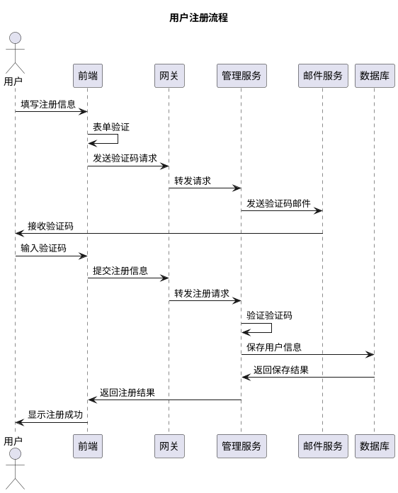
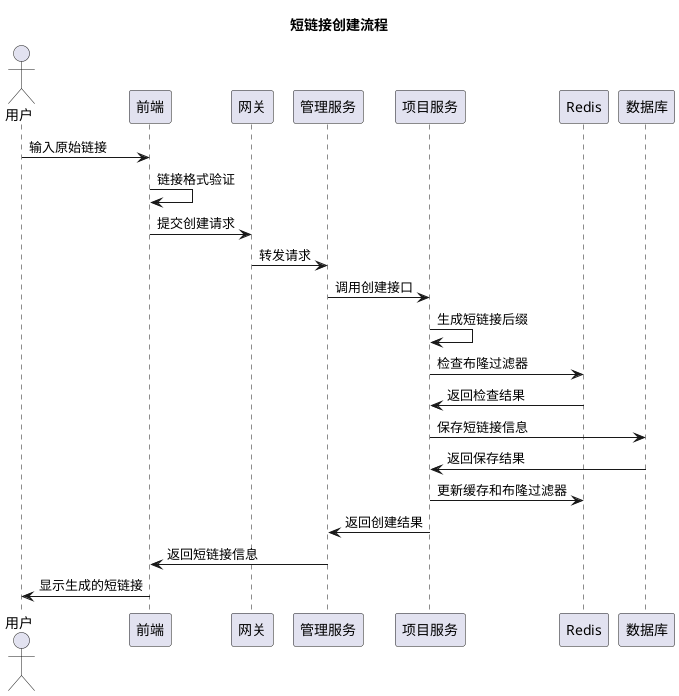
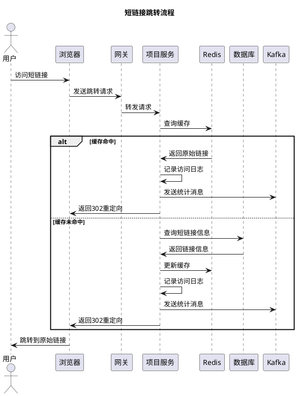
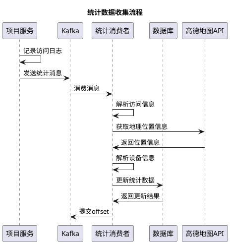
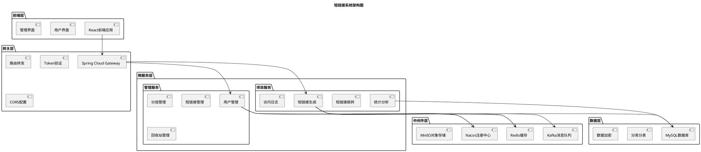
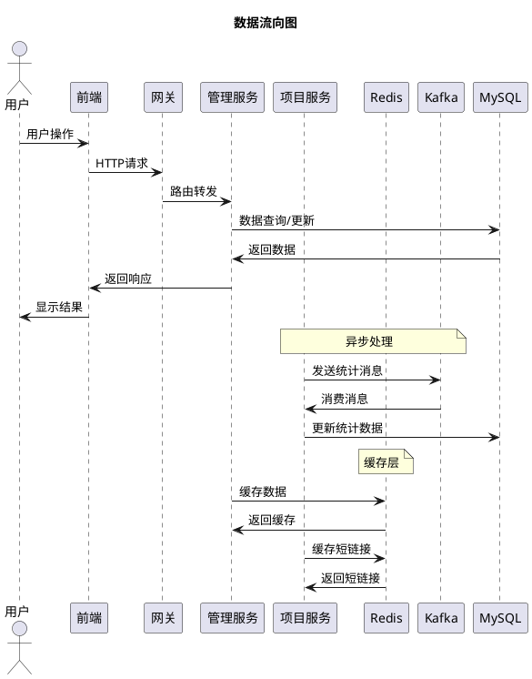
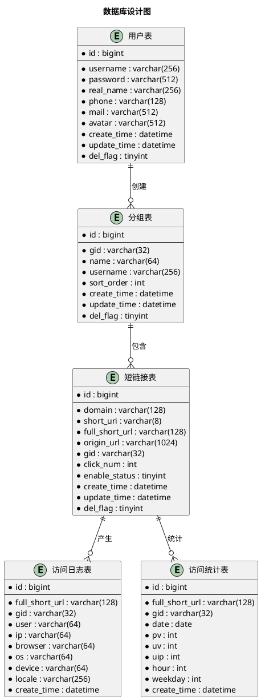

# 短链接系统项目详细文档

## 目录

1. [项目背景与意义](#1-项目背景与意义)
2. [系统可行性分析](#2-系统可行性分析)
3. [系统需求分析](#3-系统需求分析)

---

## 1. 项目背景与意义

### 1.1 项目背景

在当今数字化时代，互联网已经成为人们获取信息、进行商业活动的重要平台。随着社交媒体、移动应用和电子商务的快速发展，长链接（URL）在分享和传播过程中面临着诸多挑战：

#### 1.1.1 长链接存在的问题

- **长度限制**：社交媒体平台（如Twitter、微博）对字符数有严格限制，长链接占用大量字符空间
- **用户体验差**：长链接包含大量参数和路径，用户难以记忆和手动输入
- **视觉污染**：在文本内容中，长链接影响阅读体验和美观度
- **安全风险**：用户无法直观判断链接的真实目标，容易成为钓鱼攻击的载体
- **统计困难**：原始链接无法提供访问统计和分析数据

#### 1.1.2 市场需求分析

根据市场调研数据显示：

- **全球短链接服务市场规模**：预计2024年将达到15亿美元，年复合增长率超过20%
- **用户需求增长**：社交媒体用户数量持续增长，对短链接服务的需求同步上升
- **企业应用需求**：营销推广、数据分析、品牌保护等企业级需求日益增长
- **移动互联网发展**：移动设备普及使得短链接在移动应用中的重要性更加突出

### 1.2 项目意义

#### 1.2.1 技术意义

**1. 微服务架构实践**
- 采用Spring Cloud微服务架构，实现服务解耦和水平扩展
- 通过Nacos实现服务注册与发现，提高系统可用性
- 使用ShardingSphere实现分库分表，支持海量数据存储

**2. 高并发处理能力**
- 基于Redis缓存和布隆过滤器，实现高性能短链接跳转
- 使用Kafka消息队列异步处理统计数据，提升系统吞吐量
- 通过Sentinel实现限流降级，保障系统稳定性

**3. 数据安全与隐私保护**
- 敏感数据（手机号、邮箱、密码）采用AES加密存储
- 实现用户流量风控，防止恶意攻击
- 支持域名白名单机制，防止恶意跳转

#### 1.2.2 商业意义

**1. 降低运营成本**
- 通过自动化短链接生成和管理，减少人工操作成本
- 提供详细的访问统计，帮助企业优化营销策略
- 支持批量操作，提高工作效率

**2. 提升用户体验**
- 简洁的短链接提升分享体验
- 实时统计数据分析，帮助用户了解链接传播效果
- 支持分组管理，便于链接分类和整理

**3. 数据价值挖掘**
- 收集访问数据，提供地域、设备、浏览器等多维度分析
- 支持实时监控和历史数据查询
- 为企业决策提供数据支持

#### 1.2.3 社会意义

**1. 促进信息传播**
- 降低信息分享门槛，促进优质内容传播
- 支持社交媒体内容优化，提升传播效率
- 为公益组织和教育机构提供免费服务

**2. 推动技术发展**
- 展示现代微服务架构的最佳实践
- 为开源社区贡献高质量代码
- 促进分布式系统技术普及

**3. 数据安全示范**
- 展示数据加密和隐私保护技术
- 提供安全开发实践参考
- 推动行业安全标准建立

---

## 2. 系统可行性分析

### 2.1 经济可行性分析

#### 2.1.1 成本分析

**开发成本**
- **人力成本**：开发团队5-8人，开发周期3-6个月
- **技术成本**：使用开源技术栈，无额外授权费用
- **基础设施成本**：云服务器、数据库、缓存等基础设施成本

**运营成本**
- **服务器成本**：根据用户规模弹性扩展，初期月成本约5000-10000元
- **带宽成本**：CDN加速和负载均衡，月成本约2000-5000元
- **存储成本**：数据库和对象存储，月成本约1000-3000元
- **维护成本**：运维人员和技术支持，月成本约10000-20000元

**总成本估算**
- **初期投入**：50-100万元（开发+基础设施）
- **年度运营成本**：20-40万元
- **单用户成本**：随着用户增长，边际成本递减

#### 2.1.2 收益分析

**直接收益**
- **付费服务**：高级功能、API调用、数据导出等付费服务
- **广告收入**：在管理界面投放相关广告
- **企业服务**：为企业客户提供定制化解决方案

**间接收益**
- **数据价值**：匿名化访问数据可用于市场研究
- **品牌价值**：技术品牌建设和行业影响力
- **生态价值**：构建短链接服务生态圈

**收益预测**
- **第一年**：用户增长期，主要投入，收益有限
- **第二年**：用户规模扩大，开始盈利
- **第三年**：稳定盈利，年收益预计100-500万元

#### 2.1.3 投资回报分析

**ROI计算**
- **投资回收期**：预计18-24个月
- **净现值（NPV）**：3年期NPV预计200-800万元
- **内部收益率（IRR）**：预计25-40%

**风险控制**
- **分阶段投资**：根据用户增长情况分阶段投入
- **成本控制**：采用云服务，按需付费
- **收入多元化**：多种收入来源降低风险

### 2.2 技术可行性分析

#### 2.2.1 技术架构可行性

**微服务架构**
- **技术成熟度**：Spring Cloud生态成熟，社区活跃
- **开发难度**：团队具备相关技术栈经验
- **维护成本**：通过容器化部署，降低运维复杂度

**数据库设计**
- **分库分表**：ShardingSphere技术成熟，支持水平扩展
- **数据一致性**：通过分布式事务保证数据一致性
- **性能优化**：索引优化和查询优化提升性能

**缓存策略**
- **Redis集群**：支持高可用和水平扩展
- **缓存一致性**：通过缓存更新策略保证数据一致性
- **性能提升**：缓存命中率预计达到90%以上

#### 2.2.2 性能可行性

**并发处理能力**
- **短链接跳转**：单机QPS预计10000+，集群QPS预计100000+
- **数据写入**：通过批量写入和异步处理，支持高并发写入
- **查询性能**：通过索引优化，查询响应时间<100ms

**扩展性设计**
- **水平扩展**：服务无状态设计，支持水平扩展
- **数据库扩展**：分库分表支持数据水平扩展
- **缓存扩展**：Redis集群支持缓存水平扩展

**可用性保障**
- **服务降级**：通过Sentinel实现服务降级
- **故障恢复**：自动故障检测和恢复机制
- **数据备份**：定期数据备份和恢复策略

#### 2.2.3 安全可行性

**数据安全**
- **加密存储**：敏感数据AES加密存储
- **传输安全**：HTTPS加密传输
- **访问控制**：基于Token的身份认证和授权

**系统安全**
- **输入验证**：严格的输入验证和过滤
- **SQL注入防护**：使用参数化查询防止SQL注入
- **XSS防护**：输出编码防止XSS攻击

**运维安全**
- **日志审计**：完整的操作日志记录
- **监控告警**：实时监控和异常告警
- **安全扫描**：定期安全漏洞扫描

### 2.3 法律可行性分析

#### 2.3.1 数据保护法规

**个人信息保护法**
- **数据收集**：明确告知用户数据收集目的和范围
- **数据使用**：仅在授权范围内使用用户数据
- **数据存储**：采用加密存储保护用户隐私
- **数据删除**：提供数据删除和注销功能

**网络安全法**
- **数据本地化**：用户数据存储在中国境内
- **安全等级保护**：按照等保要求进行安全建设
- **数据出境**：严格控制数据出境，符合法规要求

#### 2.3.2 知识产权保护

**开源协议**
- **技术栈**：使用MIT、Apache等宽松开源协议
- **代码开源**：核心代码开源，促进技术交流
- **专利保护**：申请相关技术专利保护

**商标保护**
- **品牌注册**：注册相关商标和域名
- **版权保护**：软件著作权登记
- **商业秘密**：核心算法和商业策略保护

#### 2.3.3 合规要求

**ICP备案**
- **网站备案**：完成ICP备案和ICP经营许可证申请
- **域名备案**：相关域名完成备案
- **服务器备案**：服务器所在地备案

**行业规范**
- **短链接服务规范**：遵循行业最佳实践
- **数据安全标准**：符合国家数据安全标准
- **服务质量标准**：建立服务质量保障体系

### 2.4 政策可行性分析

#### 2.4.1 国家政策支持

**数字经济发展**
- **政策支持**：国家大力支持数字经济发展
- **技术创新**：鼓励技术创新和产业升级
- **人才培养**：支持技术人才培养和引进

**互联网+战略**
- **产业融合**：促进互联网与传统产业融合
- **服务创新**：鼓励互联网服务创新
- **平台建设**：支持互联网平台建设

#### 2.4.2 行业政策环境

**短链接服务**
- **行业规范**：短链接服务行业逐步规范化
- **技术标准**：相关技术标准逐步完善
- **监管要求**：监管要求逐步明确

**数据安全**
- **数据安全法**：数据安全法为数据保护提供法律依据
- **个人信息保护**：个人信息保护法加强隐私保护
- **网络安全**：网络安全法保障网络安全

#### 2.4.3 政策风险分析

**监管变化**
- **政策调整**：关注相关政策变化和调整
- **合规要求**：及时调整合规策略
- **风险应对**：建立政策风险应对机制

**行业准入**
- **资质要求**：了解行业准入资质要求
- **许可申请**：及时申请相关许可和资质
- **合规经营**：确保合规经营

---

## 3. 系统需求分析

### 3.1 总体需求分析

#### 3.1.1 业务需求

**核心业务需求**
- **短链接生成**：支持将长链接转换为短链接
- **短链接跳转**：用户访问短链接时重定向到原始链接
- **链接管理**：支持短链接的增删改查操作
- **统计分析**：提供详细的访问统计和分析数据
- **用户管理**：支持用户注册、登录、权限管理

**扩展业务需求**
- **分组管理**：支持短链接分组管理
- **回收站功能**：支持软删除和恢复功能
- **批量操作**：支持批量创建、修改、删除短链接
- **API服务**：提供RESTful API供第三方调用
- **数据导出**：支持统计数据导出功能

#### 3.1.2 功能需求

**用户功能需求**
- **注册登录**：支持邮箱注册和密码登录
- **个人信息管理**：支持个人信息修改和头像上传
- **密码管理**：支持密码修改和找回功能
- **短链接创建**：支持单个和批量创建短链接
- **短链接管理**：支持短链接的查看、修改、删除
- **统计分析**：查看短链接的访问统计数据
- **分组管理**：创建和管理短链接分组

**管理功能需求**
- **用户管理**：管理系统用户和权限
- **系统监控**：监控系统运行状态和性能
- **数据管理**：管理系统数据和配置
- **日志管理**：查看和管理系统日志
- **安全审计**：进行安全审计和风险评估

#### 3.1.3 非功能需求

**性能需求**
- **响应时间**：短链接跳转响应时间<100ms
- **并发处理**：支持10000+并发用户访问
- **数据处理**：支持百万级短链接数据存储
- **可用性**：系统可用性达到99.9%以上

**安全需求**
- **数据加密**：敏感数据加密存储和传输
- **身份认证**：基于Token的身份认证机制
- **访问控制**：基于角色的访问控制
- **安全审计**：完整的操作日志和审计功能

**可扩展性需求**
- **水平扩展**：支持服务实例水平扩展
- **数据扩展**：支持数据库分库分表扩展
- **功能扩展**：支持新功能模块的快速集成
- **接口扩展**：支持API接口的版本管理

### 3.2 功能概述

#### 3.2.1 用户管理模块

**用户注册功能**
- 支持邮箱验证码注册
- 用户名唯一性验证
- 密码强度验证
- 注册信息加密存储

**用户登录功能**
- 用户名密码登录
- Token身份认证
- 登录状态保持
- 自动登录功能

**个人信息管理**
- 个人信息查看和修改
- 头像上传和管理
- 密码修改功能
- 账户注销功能

#### 3.2.2 短链接管理模块

**短链接生成**
- 基于MurmurHash算法生成6位短链接
- 支持自定义短链接后缀
- 布隆过滤器防重复机制
- 支持批量生成短链接

**短链接跳转**
- 高性能跳转服务
- Redis缓存优化
- 缓存穿透保护
- 缓存击穿保护

**短链接管理**
- 短链接列表查看
- 短链接信息修改
- 短链接状态管理
- 短链接删除和恢复

#### 3.2.3 分组管理模块

**分组创建**
- 支持自定义分组名称
- 分组排序功能
- 分组描述信息
- 分组权限控制

**分组管理**
- 分组列表查看
- 分组信息修改
- 分组删除功能
- 分组内短链接管理

#### 3.2.4 统计分析模块

**基础统计**
- 访问量（PV）统计
- 独立访客（UV）统计
- 独立IP（UIP）统计
- 实时统计数据

**多维度统计**
- 地域统计分析
- 设备类型统计
- 浏览器统计
- 操作系统统计
- 网络类型统计

**数据可视化**
- 图表展示统计结果
- 时间趋势分析
- 对比分析功能
- 数据导出功能

#### 3.2.5 回收站模块

**软删除功能**
- 短链接软删除
- 删除时间记录
- 删除原因记录
- 批量删除功能

**恢复功能**
- 单个恢复功能
- 批量恢复功能
- 恢复权限控制
- 恢复日志记录

**彻底删除**
- 永久删除功能
- 删除确认机制
- 删除权限控制
- 删除日志记录

### 3.3 业务流程分析

#### 3.3.1 用户注册流程



#### 3.3.2 短链接创建流程



#### 3.3.3 短链接跳转流程



#### 3.3.4 统计数据收集流程



#### 3.3.5 系统架构图



### 3.4 数据流分析

#### 3.4.1 数据流向图



#### 3.4.2 数据库设计图



### 3.5 接口设计分析

#### 3.5.1 RESTful API设计

**用户管理接口**
- `POST /api/short-link/admin/v1/user` - 用户注册
- `POST /api/short-link/admin/v1/user/login` - 用户登录
- `GET /api/short-link/admin/v1/user/{username}` - 获取用户信息
- `PUT /api/short-link/admin/v1/user` - 更新用户信息
- `POST /api/short-link/admin/v1/user/change-password` - 修改密码

**短链接管理接口**
- `POST /api/short-link/admin/v1/create` - 创建短链接
- `POST /api/short-link/admin/v1/create/batch` - 批量创建短链接
- `POST /api/short-link/admin/v1/update` - 修改短链接
- `POST /api/short-link/admin/v1/page` - 分页查询短链接
- `POST /api/short-link/admin/v1/delete` - 删除短链接

**分组管理接口**
- `POST /api/short-link/admin/v1/group` - 创建分组
- `GET /api/short-link/admin/v1/group` - 查询分组列表
- `PUT /api/short-link/admin/v1/group` - 修改分组
- `DELETE /api/short-link/admin/v1/group` - 删除分组

**统计分析接口**
- `GET /api/short-link/admin/v1/stats` - 获取统计数据
- `GET /api/short-link/admin/v1/stats/access-records` - 获取访问记录
- `GET /api/short-link/admin/v1/stats/group` - 获取分组统计

#### 3.5.2 数据格式设计

**请求格式**
```json
{
  "code": 0,
  "message": "success",
  "data": {
    // 具体数据
  },
  "requestId": "uuid"
}
```

**响应格式**
```json
{
  "code": 0,
  "message": "success",
  "data": {
    // 具体数据
  },
  "requestId": "uuid"
}
```

**分页格式**
```json
{
  "code": 0,
  "message": "success",
  "data": {
    "records": [],
    "total": 100,
    "current": 1,
    "size": 10
  },
  "requestId": "uuid"
}
```

### 3.6 性能需求分析

#### 3.6.1 响应时间要求

- **短链接跳转**：< 100ms
- **短链接创建**：< 500ms
- **数据查询**：< 200ms
- **用户登录**：< 300ms
- **统计查询**：< 1000ms

#### 3.6.2 并发处理要求

- **短链接跳转**：10000+ QPS
- **短链接创建**：1000+ QPS
- **数据查询**：5000+ QPS
- **用户登录**：100+ QPS
- **统计查询**：100+ QPS

#### 3.6.3 数据存储要求

- **短链接数据**：支持千万级数据存储
- **访问日志**：支持亿级数据存储
- **统计数据**：支持千万级统计数据
- **用户数据**：支持百万级用户数据

### 3.7 安全需求分析

#### 3.7.1 数据安全

- **敏感数据加密**：手机号、邮箱、密码AES加密存储
- **传输加密**：HTTPS加密传输
- **数据备份**：定期数据备份和恢复
- **数据脱敏**：日志和统计数据进行脱敏处理

#### 3.7.2 访问安全

- **身份认证**：基于Token的身份认证
- **权限控制**：基于角色的访问控制
- **接口限流**：防止恶意请求和DDoS攻击
- **输入验证**：严格的输入验证和过滤

#### 3.7.3 系统安全

- **安全审计**：完整的操作日志记录
- **漏洞扫描**：定期安全漏洞扫描
- **监控告警**：实时安全监控和告警
- **应急响应**：安全事件应急响应机制

---

## 总结

本短链接系统项目具有明确的市场需求和技术可行性，通过微服务架构、分库分表、缓存优化等技术手段，能够满足高并发、高可用的业务需求。系统设计充分考虑了数据安全、用户体验和扩展性，具有良好的商业前景和技术价值。

项目采用现代化的技术栈和架构设计，符合当前互联网行业的发展趋势，能够为用户提供稳定、安全、高效的短链接服务，同时为企业提供有价值的数据分析和营销支持。

通过详细的需求分析和可行性研究，该项目具备了成功实施的基础条件，预期能够取得良好的经济效益和社会效益。
